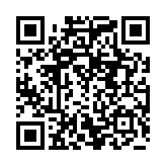
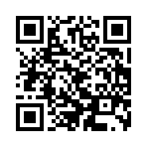
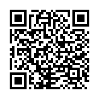

<!-- SPDX-License-Identifier: GPL-3.0-only -->

# cosmostrix Commercial License

cosmostrix is dual-licensed:

- **GPL-3.0-only** for open-source use — see [LICENSE](LICENSE).
- **Commercial License** for proprietary and commercial use — this document.

If your use of cosmostrix satisfies the GPL-3.0-only copyleft terms, you may
use it for free under the open-source license. If it cannot — because you
ship a closed-source product, run a paid hosted service, or keep internal
business tooling proprietary — you need a commercial license. This document
defines who needs one, what each tier grants, and how to buy it.

## Who Needs a Commercial License

You need a commercial license if any of the following applies:

- Your company runs cosmostrix in production as part of its business.
- You offer a SaaS or any paid hosted service built on cosmostrix.
- You build internal business tools around cosmostrix and cannot release
  the surrounding proprietary code under GPL-3.0-only.
- You redistribute cosmostrix, in whole or in part, inside a product you
  distribute or sell.
- Any other use that cannot meet the copyleft obligations of GPL-3.0-only.

## Who Does NOT Need a Commercial License

You do not need a commercial license for:

- Personal use, hobby projects, and experimentation.
- Non-commercial research and evaluation.
- Education and teaching.
- Open-source contributions back to the upstream project — contribution
  forks are covered by GPL-3.0-only and [TRADEMARK.md](TRADEMARK.md) §4a.

In all of these cases the GPL-3.0-only license in [LICENSE](LICENSE) is
sufficient and no payment is required.

## Pricing

All prices are annual, pegged to USD, and payable in cryptocurrency (see
[Payment](#payment)). Tiers are self-declared by the buyer in good faith.

| Tier       | Price          | Target                                                       |
| ---------- | -------------- | ------------------------------------------------------------ |
| Personal   | Free (GPL-3.0) | Hobby, personal, non-commercial, open-source contributions   |
| Individual | $99/year       | Solo devs, freelancers, revenue < $100K/year                 |
| Business   | $1,000/year    | SMB, revenue $100K–$10M/year                                 |
| Company    | $9,900/year    | Enterprise (>$10M/year revenue) OR any redistribution rights |

Multi-year contracts are available at the owner's discretion: 20% off a
2-year contract, 30% off a 3-year contract. No free tier above Personal is
granted without explicit owner approval.

## What Each Tier Grants

Every paid tier grants the right to use cosmostrix in commercial work
without GPL-3.0-only copyleft obligations, plus priority support from the
maintainer:

- **Individual ($99/year)** — solo developers and freelancers with annual
  revenue under $100K.
- **Business ($1,000/year)** — small and medium businesses with annual
  revenue from $100K to $10M.
- **Company ($9,900/year)** — enterprises above $10M annual revenue, and
  any buyer who needs redistribution rights: embedding or reselling
  cosmostrix inside your own products. Redistribution additionally requires
  trademark permission (see [TRADEMARK.md](TRADEMARK.md)).

The Personal tier is the GPL-3.0-only license itself — free, including its
copyleft obligations; no commercial license document is issued.

## Payment

Payment is USD-pegged: send the cryptocurrency equivalent of the USD price
at purchase time. The exchange rate is verified via CoinGecko or
CoinMarketCap at the moment of purchase. The owner-verified receive
addresses follow.

### Solana (SOL / USDT-SPL)

```text
88umzS7abaToaGQVgTVXt5SnuvcjTw2jPSM6Ha2JYmXM
```



### Ethereum (ETH / USDT-ERC20 / USDC-ERC20)

```text
0x1bCbA21c07B5636a942De27AA7Ee8283cEDb4C3D
```



### Bitcoin (BTC, Taproot P2TR)

```text
bc1p88nqysn4p8u9zxwz2pyxs5pl77wllcrk6ca2r2l3ryr3863hxkys5vdkze
```



Network mismatches lose funds permanently — send Solana assets on Solana,
ERC-20 assets on Ethereum mainnet, and Bitcoin to the Taproot address only.
Always double-check the address on screen before sending.

## Verification Process

1. Send the payment to one of the addresses above.
2. Email the transaction hash together with your licensing inquiry to
   [with.rezky@gmail.com](mailto:with.rezky@gmail.com).
3. The owner verifies the transaction on-chain.
4. Upon confirmation, a license PDF is issued within 48 hours.

The issued license identifies the licensee, the purchased tier, and the
validity period.

## Contact

- Licensing email: [with.rezky@gmail.com](mailto:with.rezky@gmail.com)
- GitHub: [@oxyzenQ](https://github.com/oxyzenQ)

## Relationship to Trademarks and Donations

Commercial licensing is separate from trademark licensing — using the
cosmostrix name, logo, or branding in derivative products requires written
permission under [TRADEMARK.md](TRADEMARK.md). The voluntary crypto donation
addresses in [README.md](README.md) are support tips for the open-source
project; they are separate from commercial licensing and grant no
commercial rights.
<!-- COSMOSTRIX-DISCLAIMER -->
<!--
  Documentation Disclaimer — read before relying on any data point.

  This document may contain stale data, hardcoded counts, or outdated
  file paths and symbol names. Maintainers update source code but may
  forget to sync every doc — the project ships 80+ .md files and
  perfect sync is a known maintenance burden with diminishing returns.

  Source code (`src/**/*.rs`) is the single source of truth.
  Always cross-check against the actual `.rs` files before relying on
  any specific number (test count, LOC, FPS, ms timeout), file path,
  function name, or config key.

  If you find a discrepancy, please open a PR — the doc is wrong, not
  the source.
-->
