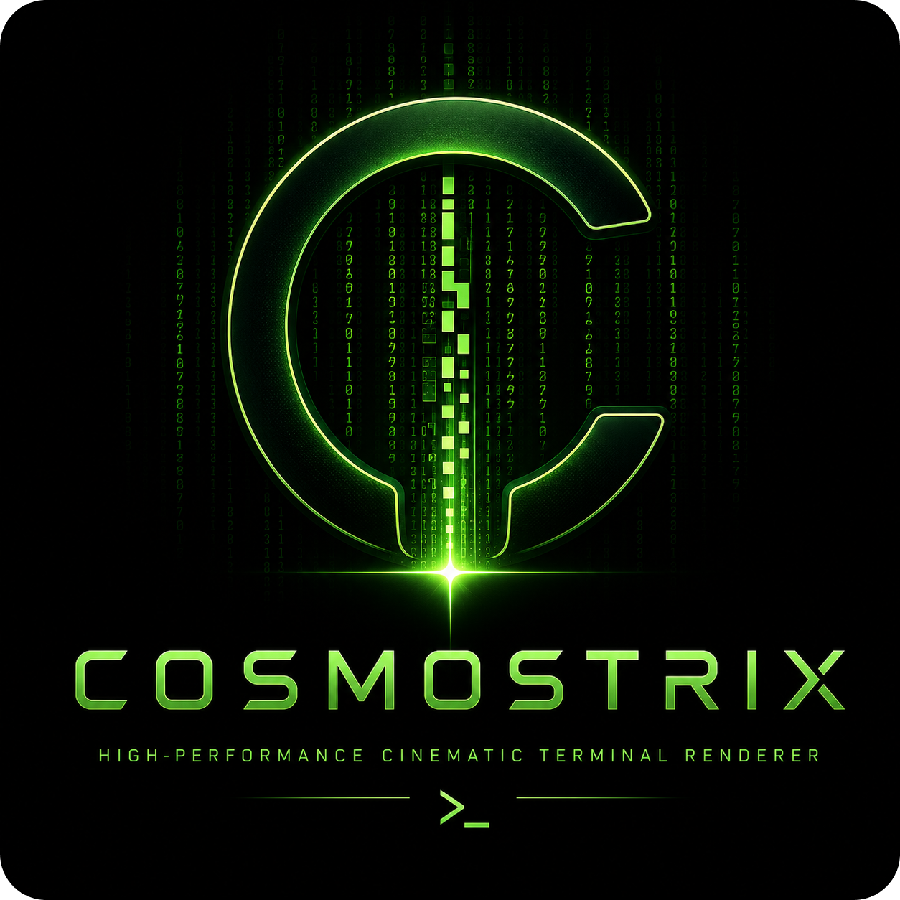

<p align="center">
  
</p>

<h1 align="center">COSMOSTRIX</h1>

<p align="center">
  <strong>High-performance cinematic terminal renderer</strong>
</p>

<p align="center">
  
  
  
  
</p>

<p align="center">
  <a href="https://ko-fi.com/rezky">
    
  </a>
</p>

## Demo

<p align="center">
  
</p>

<details>
<summary>Watch full video demo (47s)</summary>

<video src="assets/cosmostrix-long-endurance.mp4" autoplay loop muted playsinline width="100%"></video>

</details>

[Watch on YouTube](https://www.youtube.com/watch?v=KSk-DWFdg3A)

## Features

- 42 built-in color schemes and 24 character set presets
- Cinematic animation engine with phosphor persistence, depth fog, and parallax layers
- Configurable speed, density, FPS, and glitch intensity
- Alternate screen with diff-based rendering — no scrollback spam
- Adaptive throttling: reduces CPU usage when idle
- Screensaver mode
- Cross-platform: Linux, macOS, Windows, Android (Termux)

## Requirements

- Rust stable toolchain to build from source
- A terminal supporting ANSI escape sequences, alternate screen, and raw mode
- Best results with 256-color or truecolor terminals

## Quickstart

```bash
# Run from source
cargo run --release

# Build a release binary
cargo build --release

# Run with a color scheme
./target/release/cosmostrix --color rainbow --speed 12
```

## Installation

### GitHub Releases (prebuilt binaries)

Download from [Releases](https://github.com/oxyzenQ/cosmostrix/releases), verify the checksum, and place `cosmostrix` in your `PATH`.

**Available platforms:**

- Linux x86_64: `v1` (compatible), `v2`, `v3`, `v4`
- macOS: `darwin-aarch64-native` (Apple Silicon)
- Windows: `windows-x86_64`, `windows-aarch64-native`
- Android (Termux): `android-aarch64-native`

```bash
REPO="oxyzenQ/cosmostrix"
TAG="v2.0.0-stable.1"
PLATFORM="linux-x86_64-v3"
curl -LO "https://github.com/${REPO}/releases/download/${TAG}/cosmostrix-bin-${TAG}-${PLATFORM}.tar.gz"
curl -LO "https://github.com/${REPO}/releases/download/${TAG}/cosmostrix-bin-${TAG}-${PLATFORM}.tar.gz.sha512"
sha512sum -c "cosmostrix-bin-${TAG}-${PLATFORM}.tar.gz.sha512"
tar -xzf "cosmostrix-bin-${TAG}-${PLATFORM}.tar.gz"
./cosmostrix -i
```

### AUR (Arch Linux)

```bash
paru -S cosmostrix-bin    # or: yay -S cosmostrix-bin
```

### From source

```bash
git clone https://github.com/oxyzenQ/cosmostrix.git
cd cosmostrix
cargo install --path .
cosmostrix -i
```

### Optimized local builds

For a modern Linux x86_64 machine, the recommended optimized build is:

```bash
cargo pro-linux-v3
# equivalent:
COSMOSTRIX_BUILD=linux-x86_64-v3 COSMOSTRIX_PROFILE=pro-linux-v3 \
  RUSTFLAGS="-C target-cpu=x86-64-v3" \
  cargo build --profile pro-linux-v3 --target x86_64-unknown-linux-gnu
```

Artifact variants use explicit CPU baselines:

- `linux-x86_64-v1`: maximum x86_64 compatibility
- `linux-x86_64-v2`: newer baseline with SSE4.2/POPCNT-era CPUs
- `linux-x86_64-v3`: AVX2/BMI2/FMA-era CPUs
- `linux-x86_64-v4`: AVX-512 baseline
- `native`: local-only build tuned for the current CPU; not used for distributed Linux x86_64 artifacts

Release/pro builds keep `panic = "unwind"` on purpose. Cosmostrix owns raw mode,
alternate screen, cursor visibility, and mouse capture while running; unwinding
lets the RAII terminal guard and panic hook restore the terminal on panic.

To verify an optimized artifact:

```bash
target/x86_64-unknown-linux-gnu/pro-linux-v3/cosmostrix -i
file target/x86_64-unknown-linux-gnu/pro-linux-v3/cosmostrix
readelf -S target/x86_64-unknown-linux-gnu/pro-linux-v3/cosmostrix | grep -E '\.debug|\.symtab'
scripts/verify-release-build.sh pro-linux-v3
```

## Usage

```bash
cosmostrix                           # default settings
cosmostrix --color rainbow --speed 12   # color + speed
cosmostrix --screensaver              # exit on keypress
cosmostrix --message "wake up, neo"   # overlay message
cosmostrix --charset katakana         # character set
cosmostrix --low-power                # power-saving mode
```

## CLI options

Run `cosmostrix --help` for common options or `cosmostrix --help-detail` for the full reference.

```text
COMMON OPTIONS
  -c, --color <name>        Color theme
     --charset <name>       Character preset
  -f, --fps <1-240>         Target FPS
  -S, --speed <0.001-1000>  Rain speed
  -d, --density <0.01-5.0>  Rain density
  -s, --screensaver         Exit on keypress
  -m, --message <text>      Overlay message
     --low-power            Power-saving mode
     --glitch-level <level> Glitch intensity (none|subtle|default|intense)

DIAGNOSTICS
     --doctor               Compatibility report
     --benchmark            Renderer benchmark
  -i, --info                Build and runtime information

DISCOVERY
     --list-colors          Show available color themes
     --list-charsets        Show available charset presets
     --defaults             Show the default runtime profile
```

## Runtime controls

```text
  q / Esc       Quit              p          Pause / resume
  c / C         Cycle theme       s / S      Cycle charset
  [ / ]         Density           Up / Down  Speed
  g             Toggle glitch     Tab        Toggle shading
  Space         Reseed animation  m          Cycle profile
```

## Config file

Persistent defaults can be set in `~/.config/cosmostrix/config` (or `$XDG_CONFIG_HOME/cosmostrix/config`).

```
color = ocean
charset = matrix
fps = 60
speed = 10
density = 1.5
glitch-level = default
```

CLI arguments always take precedence over config file values. See `--defaults` for the curated default profile.

## Color schemes

42 themes available. Run `--list-colors` to see all, including space-themed sets (cosmos, nebula, stars, aurora, galaxy, supernova, and more).

## Character sets

24 presets available. Run `--list-charsets` to see all (binary, matrix, katakana, braille, cyberpunk, hacker, and more).

## Performance & benchmarking

Use deterministic sanity checks in CI and measure performance locally. The
repeatable benchmark path is:

```bash
bash benchmark/benchmark.sh
```

See `benchmark/README.md` for the exact commands, generated artifacts, and
notes on comparing release vs local `pro-native` builds.

## Release notes

### v2.0.0-stable.1

- Fixed stale glyph artifacts in the top visible rows during charset and theme changes.
- Fixed long-idle rain/trail resync issues with wall-clock redraw scheduling and focus/input redraw resync.
- Clarified benchmark dirty-cell and color-mode metrics so differential rendering reports are easier to interpret.
- Fixed direct-color auto-detection for `xterm-direct` and `tmux-direct`.
- Removed unused low-value support code while preserving rendering behavior.
- Completed 10h+ visual soak checks across Alacritty, Konsole, and WezTerm.
- Resource monitoring found no memory, file descriptor, thread, swap, CPU, or IO leak during the release soak.

## Development

```bash
cargo fmt --all
cargo clippy --locked --all-targets --all-features -- -D warnings
cargo test --all --locked
scripts/verify-release-build.sh pro-linux-v1 pro-linux-v2 pro-linux-v3
```

## Release process

Create a release by pushing a `v*` tag. See `workflow/about-ci.md` for CI and release workflow details.

## Contributing

PRs and issues are welcome. Please run `cargo fmt` and `cargo clippy` before submitting.

## Support

cosmostrix is an open-source project built and maintained independently.

If this project helped you, or saved development time, you can support future maintenance here:

[](https://ko-fi.com/rezky)

Support is optional. The project remains open-source.

## License

MIT. See `LICENSE`. Brand usage governed by `TRADEMARK.md`.
