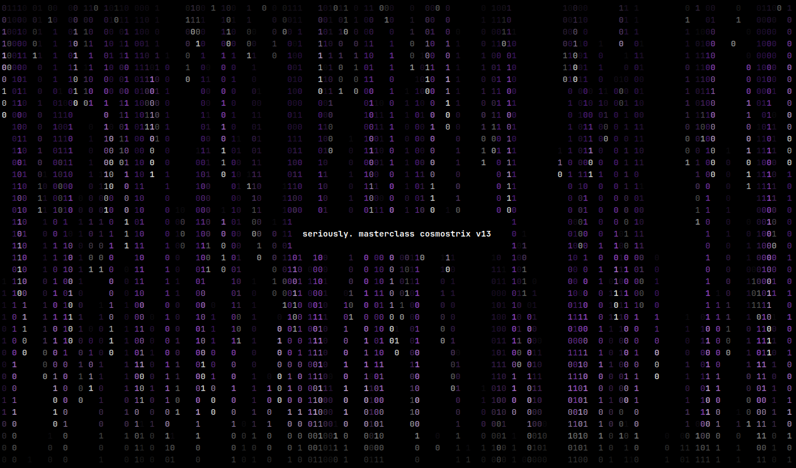
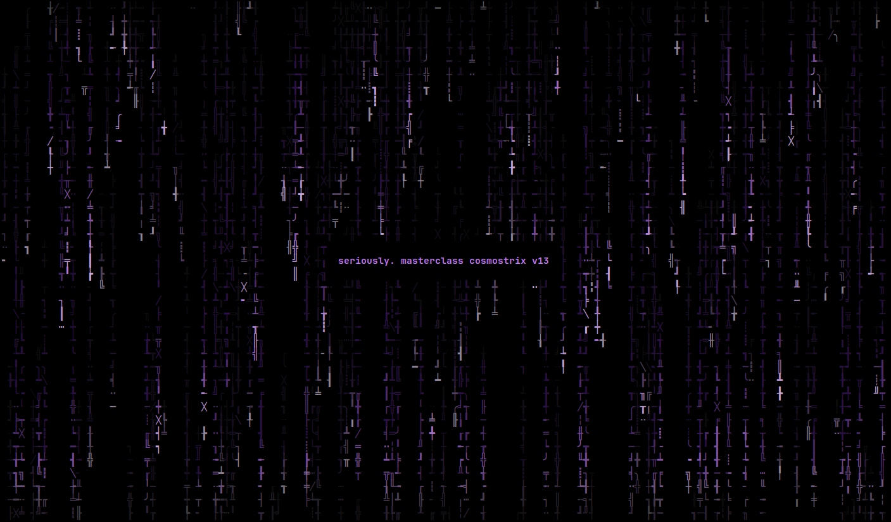
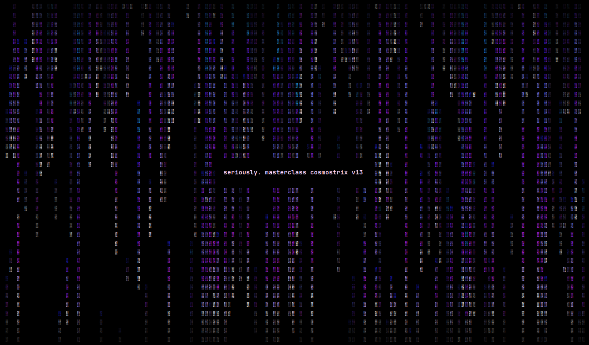
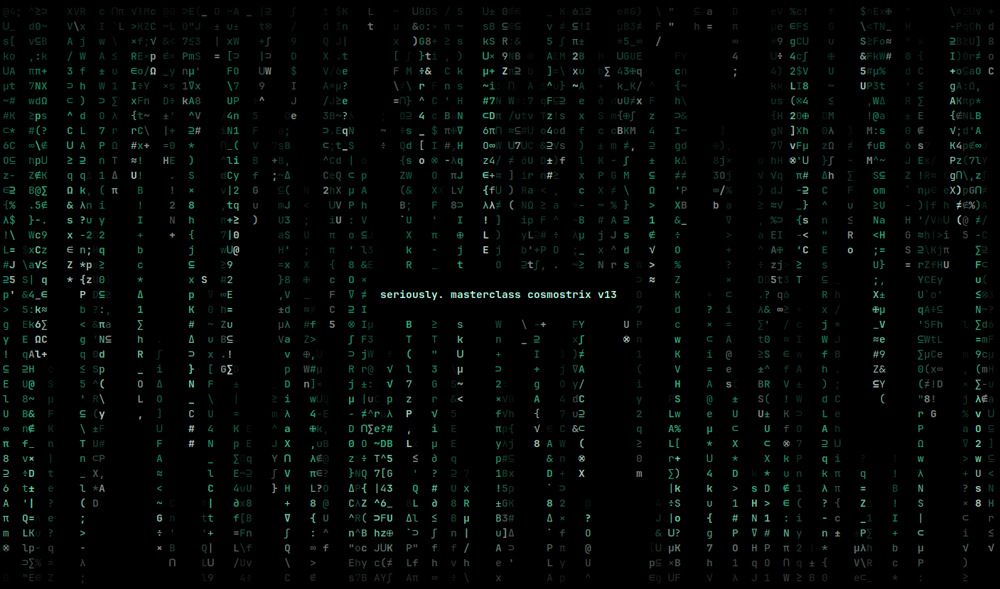
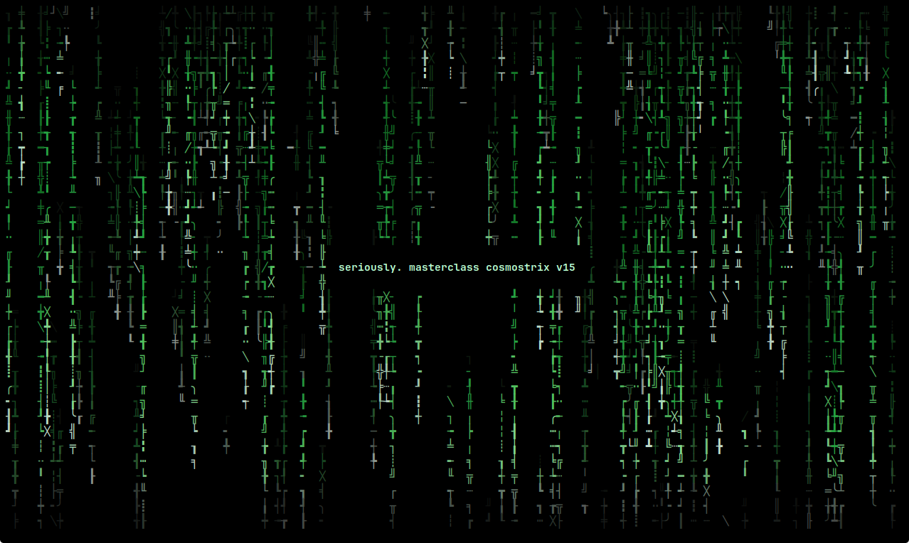

<!-- SPDX-License-Identifier: GPL-3.0-only -->

<p align="center">
  
</p>

<h1 align="center">cosmostrix</h1>

<p align="center">
  <strong>Production-grade cinematic Matrix rain renderer for serious terminal environments.</strong>
</p>

<p align="center">
  Engineered for smooth rendering, configurable atmosphere, clean terminal recovery, and reliable cross-platform operation.
</p>

<p align="center">
  <a href="https://ko-fi.com/rezky">
    
  </a>
</p>

## Demo

<p align="center">
  
</p>

<p align="center">
  
  <br>
  
  <br>
  
  <br>
  
  <br>
  
</p>

<p align="center">
  <a href="https://www.youtube.com/watch?v=KSk-DWFdg3A">YouTube</a>
</p>

Signature Monolith Rain, cinematic themes, and message mode in a real terminal session.

## Features

- **Cinematic terminal rain** — calm, organic, premium visual feel with crisp head/body/trail hierarchy and desynchronized column speeds (async mode default ON for organic feel)
- **11 built-in scenes** — one-command visual profiles: 3 core atmospheres (matrix, monolith, signal) and 8 curated scenes (classic, cinematic, calm, storm, cosmos, neon, hacker, low-power), including signature Cosmostrix Monolith Rain
- **User-defined custom scenes** — `[scene-custom.<name>]` blocks in config for persistent personal themes, applied via `--scene-custom`; supports 12 configurable fields including density-map sculpting for monolith pillar formations
- **Adaptive custom time scheduling** — `adaptive-custom.HH-MM` config entries define your own 24-hour time-to-parameter mapping (color, scene, speed, density, FPS, charset, glitch-level) with smoothstep 5-minute blend transitions; overrides the default 5-phase adaptive engine when defined; sticky parameters keep previous values when unspecified; live config reload re-parses immediately on save
- **Default adaptive atmosphere engine** — 5-phase time-driven modulation (Deep Void → Compression → Pulse → Calm → Signal) that smoothly transitions speed, density, brightness, glitch pressure, and color palette based on local wall-clock time; opt-in via `atmosphere-mode = controlled-live`
- 43 built-in themes and 24 character sets (5 themes — Green3, Saturn, Comet, Meteor, Pluto — re-tuned in v11.1.0 for visual distinctness; `--color-tune` turns all 43 into 43 × ∞ variants)
- Phosphor persistence (CRT afterglow), depth fog, and 3-layer parallax
- TrueColor green gradients with luminous head glow
- Configurable speed, density, FPS, and glitch intensity
- Density map sculpting — per-column weight maps (0.0–1.0) for cinematic monolith formations (e.g. twin pillars, cascading waterfall, central throne)
- Auto color drift — cycle color scheme over time (`--color-drift` / `auto-color-drift` in config)
- Message overlay — display custom text on the rain (`--message "wake up, neo"`)
- Alternate screen with diff-based rendering — no scrollback spam, RLE batched output
- Live HUD — real-time FPS, p99, max frame-time, RSS, and uptime overlay (toggle with `i`, move with `H`)
- Phase-aware endurance subsystem — EMA-based activity prediction (PAP), idle coalescing (IPAC), memory reclaim hints (MPAR), and Endurance Health Score (EHS, 0–100) for long-running sessions
- Adaptive throttling: reduces CPU usage when idle
- Live config reload via filesystem watch (optional, `notify` crate) — full Cloud rebuild with strict validation on save
- Screensaver mode — only `q` exits; recognized keys (c/s/x/i/etc.) still work
- Always-on mouse glow + click wave effects (cursor halo + dual-ring ripple)
- Fixed virtual screen size (`--screen-size WxH`) for benchmarking at exact dimensions or rendering independent of terminal resize
- 5-layer destructive terminal recovery (`--reset-terminal`)
- Controlled atmosphere engine with 6 opt-in regimes (pulse, signal, compression, void, monolith-pressure, calm)
- Benchmark mode with JSON output, compound duration format (`--duration 1h30m`), self-documenting reports (CPU model, rustc, LTO/PGO, git SHA)
- Terminal diagnostics (`--doctor`) and config validation (`--testconf`)
- Cross-platform: Linux, macOS, Windows, Android (Termux)

## Philosophy

Cosmostrix is a CPU-only terminal renderer by design. The terminal is a text medium — its soul is ANSI escape sequences, copy-pasteable glyphs, and the slow poetry of a phosphor decay. A GPU would paint an image; Cosmostrix writes a sentence. No GPU context (OpenGL, Vulkan, Metal, DirectX, WebGPU) is ever created — the benchmark reports `gpu_usage: not_applicable`. GPU image-mode via the kitty graphics protocol was evaluated and rejected because it would change Cosmostrix from "terminal rain" to "image rain", which is a different program. See [docs/PHILOSOPHY.md](docs/PHILOSOPHY.md) for the full rationale.

## Limitations

Cosmostrix is a CPU-only terminal renderer with deliberate scope. The list below is honest about what it does not do — most of these are design choices, not missing features.

- **CPU-only, no GPU.** Rain is rendered as ANSI text over a PTY; no GPU context is ever created (the benchmark reports `gpu_usage: not_applicable`). GPU bitmap rendering was evaluated and rejected because it changes the character-grid aesthetic. See [docs/DRAGON_EXPLORATION.md](docs/DRAGON_EXPLORATION.md).
- **Interactive FPS is terminal-bounded.** The engine computes ~50,000 FPS headless at 120×40; real on-screen FPS is bounded by your terminal emulator's ANSI parse speed (typically 60–240 FPS on Alacritty/kitty, less on slower terminals). This is a fundamental limit of terminal rendering.
- **`kill -9` cannot be caught.** No process can intercept SIGKILL. On Linux, a fork-based guard restores `termios` best-effort; on macOS and Windows, run `cosmostrix --reset-terminal` for 5-layer recovery.
- **SIGTSTP (Ctrl-Z) suspends in raw mode.** The terminal stays in raw mode while cosmostrix is backgrounded. Recovery is automatic on `fg`/SIGCONT as long as nothing else wrote to the TTY.
- **Windows Terminal cleanup is best-effort** ([#15](https://github.com/oxyzenQ/cosmostrix/issues/15)). Forced termination (task kill, close window, signout) on Windows Terminal / ConHost may leave the terminal in a degraded state (scrolled buffer visible, cursor hidden). Beyond what crossterm provides, cosmostrix does not claim specific guarantees for Windows forced-termination paths. Run `cosmostrix --reset-terminal` to recover.
- **RSS and CPU metrics are Linux/macOS only.** `--benchmark` emits `unsupported` on Windows rather than fake values.
- **No audio.** Cosmostrix is a visual screensaver.

## Requirements

- Rust 1.81+ (MSRV) to build from source
- Linux kernel 2.6.27+ / macOS 10.12+ / Windows 10 1809+
- A terminal supporting ANSI escape sequences, alternate screen, and raw mode
- Best results with 256-color or truecolor terminals

For the full compatibility matrix (kernel versions, glibc/musl, CPU architectures, terminal capabilities), see [System Requirements](docs/SYSTEM_REQUIREMENTS.md).

## Installation

### GitHub Releases (prebuilt binaries)

Download from [Releases](https://github.com/oxyzenQ/cosmostrix/releases), verify the checksum, and place `cosmostrix` in your `PATH`.

Each release ships **three** checksums: classical SHA-512 + quantum-resistant
BLAKE2b-512 + SHAKE256. Full instructions in
[docs/VERIFY_RELEASE.md](docs/VERIFY_RELEASE.md).

```bash
# Classical (universal)
sha512sum -c cosmostrix-vX.Y.Z-linux-amd64-musl.tar.gz.sha512sum

# Quantum-resistant — BLAKE2b (fastest, in coreutils)
b2sum -c cosmostrix-vX.Y.Z-linux-amd64-musl.tar.gz.b2sum

# Quantum-resistant — SHAKE256 (NIST PQ standard, via Python)
# openssl's -shake256 default output length varies; Python is consistent
COMPUTED=$(python3 -c "import hashlib; print(hashlib.shake_256(open('cosmostrix-vX.Y.Z-linux-amd64-musl.tar.gz','rb').read()).hexdigest(64))")
EXPECTED=$(awk '{print $1}' cosmostrix-vX.Y.Z-linux-amd64-musl.tar.gz.shake256)
[ "$COMPUTED" = "$EXPECTED" ] && echo "OK" || echo "FAILED"
```

**Available platforms:**

- Linux amd64: `v3`, `v4`, `musl` (also `linux-aarch64` for arm64)
- macOS: `darwin-aarch64-native` (Apple Silicon)
- Windows: `windows-x86_64`, `windows-aarch64-native`
- Android (Termux): `android-aarch64-native`

```bash
REPO="oxyzenQ/cosmostrix"
TAG="v15.0.0"
PLATFORM="linux-amd64-v3"
curl -LO "https://github.com/${REPO}/releases/download/${TAG}/cosmostrix-${TAG}-${PLATFORM}.tar.gz"
curl -LO "https://github.com/${REPO}/releases/download/${TAG}/cosmostrix-${TAG}-${PLATFORM}.tar.gz.sha512sum"
sha512sum -c "cosmostrix-${TAG}-${PLATFORM}.tar.gz.sha512sum"
tar -xzf "cosmostrix-${TAG}-${PLATFORM}.tar.gz"
./cosmostrix -i
```

### AUR (Arch Linux)

```bash
paru -S cosmostrix-bin    # or: yay -S cosmostrix-bin
```

### From source

```bash
git clone https://github.com/oxyzenQ/cosmostrix.git
cd cosmostrix
cargo install --path .
cosmostrix -i
```

### Optimized local builds

For a modern Linux x86_64 machine, the recommended optimized build is:

```bash
cargo pro-linux-v3
```

Artifact variants use explicit CPU baselines:

| Variant | Baseline |
|---|---|
| `linux-amd64-v3` | AVX2 / BMI2 / FMA-era CPUs (2013+, most modern x86_64) |
| `linux-amd64-v4` | AVX-512 baseline (high-end server/workstation) |
| `linux-amd64-musl` | v3 baseline + statically linked (max portability) |
| `native` | Local-only build tuned for the current CPU |

> **Note:** v1/v2 x86_64 variants were dropped in v11.0.0. Modern CPUs
> (2013+) support v3. For maximum portability (Alpine, containers,
> minimal base images), use the `musl` variant — it's statically linked
> with no glibc dependency.

Release/pro builds keep `panic = "unwind"` on purpose. Cosmostrix owns raw mode,
alternate screen, cursor visibility, and line-wrap state while running; unwinding
lets the RAII terminal guard and panic hook restore the terminal on panic.

To verify an optimized artifact:

```bash
target/x86_64-unknown-linux-gnu/pro-linux-v3/cosmostrix -i
file target/x86_64-unknown-linux-gnu/pro-linux-v3/cosmostrix
scripts/verify-release-build.sh pro-linux-v3
```

## Quickstart

```bash
cosmostrix                           # signature Monolith Rain default
cosmostrix --color rainbow --speed 12   # color + speed
cosmostrix --screensaver              # only q exits (all other keys ignored)
cosmostrix --message "wake up, neo"   # overlay message
cosmostrix --charset katakana         # character set
cosmostrix --scene cinematic          # built-in scene
cosmostrix --scene monolith --color deepspace
cosmostrix --config ~/.config/cosmostrix/config.toml  # explicit config (whitelist-enforced)
cosmostrix --scene-custom nightcore   # user-defined custom scene
```

## CLI Reference

Run `cosmostrix --help` for common options or `cosmostrix --help-detail` for the full reference.

```text
COMMON OPTIONS
  -c, --color <name>        Color theme (see --list-colors)
     --color-custom <name>  Load a user-defined custom color palette from config (v16)
     --color-tune <k=v>     Tune saturation/brightness (e.g. saturation=1.5,brightness=0.9)
     --brightness <0.0-3.0>  Brightness multiplier (1.0 = no change)
     --saturation <0.0-3.0>  Saturation multiplier (1.0 = no change; 0.0 = grayscale)
  -C, --charset <name>      Character set (see --list-charsets)
     --charset-file <path>  Load custom characters from a file (whitelist-enforced)
  -f, --fps <1-240>         Target FPS
  -S, --speed <1-100>       Rain speed
  -d, --density <0.01-5.0>  Rain density
  -s, --screensaver         Only q exits (all other keys ignored). Mouse events captured to block selection
     --mouse                (deleted v17: effects always on)
  -m, --message <text>      Overlay message (use -mb for border)
     --glitch-level <level> Glitch intensity (none|subtle|default|intense)
     --scene <name>         Apply a built-in scene atmosphere (see --list-scenes)
     --scene-custom <name>  Apply a user-defined custom scene from config

ADVANCED
     --monolith-size <size> Monolith segment cell scale (small|normal|large)
     --uniform              Uniform column speeds (disables async variable pacing)

CONFIG
     --config <path>        Load config from an explicit file (strict whitelist + .toml)
     --dump-config [path]   Print example config to stdout, or write to file (whitelist + .toml)
     --config-path          Print the resolved default config path
     --testconf             Validate config.toml and report errors (exit 0 = pass, 2 = fail)

DIAGNOSTICS
     --doctor               Compatibility report
     --benchmark            Renderer benchmark (5s default; override with --bench-duration)
     --bench-duration <dur> Benchmark duration (e.g. 5, 6s, 30m, 1h30m; min 1s)
     --json                 Output benchmark as JSON (use with --benchmark; for CI/scripts)
     --screen-size <WxH>    Fixed screen size (e.g. 120x40; min 1x1)
     --bench-io             Benchmark with wet terminal I/O (writes ANSI to /dev/null)
     --bench-all            Run benchmark across multiple screen sizes (6x6 to 200x60)
     --save-baseline <path> Save benchmark JSON for later comparison
     --compare-baseline <p> Compare against saved baseline (flags >5% FPS regressions)
  -i, --info                Build and runtime information
     --reset-terminal       Emergency terminal recovery (5-layer: ANSI + crossterm + stty + reset)
  -v, --verbose             Print diagnostic info to stderr (with [HH:MM] timestamps)

DISCOVERY
     --list-colors          Show compact color theme names (43 built-in themes)
     --list-charsets        Show available character sets (24 built-in sets)
     --list-scenes          Show built-in and custom scenes
     --show-scene <name>    Show full details for a scene

HELP
     --help-detail          Full advanced documentation
  -V, --version             Print complete version and build information
     --check-update         Check the latest upstream release
  -h, --help                Print help
```

Explicit CLI flags always override scene and scene-custom values.

## Runtime Controls

Only `q` quits. All other unrecognized keys are silently ignored (no glitch, no accidental exit). Mouse click does NOT exit (v17: removed for consistency with the "only q quits" policy). Mouse events are still captured to block text selection.

```text
  q             Quit              p          Pause / resume
  c / C         Cycle theme       s / S      Cycle charset
  x / X         Cycle scene       [ / ]      Density
  Up / Down     Speed             g          Toggle glitch
  m             Cycle behavior    Space      Reseed animation
  a             Toggle async
  i             Toggle live HUD (FPS / p99 / max / RSS / uptime)
  H or h        Move HUD to opposite corner (left ↔ right)
```

## Scenes

**Core atmospheres** (interactive cycle with `x`/`X`):
- `monolith` — default signature Cosmostrix Monolith Rain with sparse structured segments
- `matrix` — classic Matrix glyph rain
- `signal` — digital transmission / code-signal atmosphere

**Curated scenes** (via `--scene <name>`):
- `classic`, `cinematic`, `calm`, `storm`, `cosmos`, `neon`, `hacker`, `low-power`

Press `x` or `X` while running to cycle core atmospheres: Monolith → Matrix → Signal → Monolith.

## Configuration

Persistent defaults can be set in `~/.config/cosmostrix/config.toml` (or `$XDG_CONFIG_HOME/cosmostrix/config.toml`). Use `--config <path>` to load a specific file. For security, `--config`, `--charset-file`, and `--dump-config <path>` enforce a **strict whitelist** — only these directories are allowed:

- `~/.config/cosmostrix/` (Linux/macOS, user config)
- `/etc/cosmostrix/` (Linux/macOS, system-wide)
- `%APPDATA%\cosmostrix\` (Windows, user config)
- `%ProgramData%\cosmostrix\` (Windows, system-wide)

Everything else is rejected: current directory (`.`), `/tmp/`, home root (`~`), `~/.local/`, `/usr/`, `/opt/`, `/var/`, all relative paths, and all other absolute paths. `--config` and `--dump-config <path>` files must also have a `.toml` extension.

To generate a starter config, use `--dump-config` with an explicit path:

```bash
cosmostrix --dump-config ~/.config/cosmostrix/config.toml
```

Shell redirection (`cosmostrix --dump-config > file`) is **blocked** — cosmostrix detects stdout-redirected-to-file and refuses to write, because the shell bypasses the whitelist. Use the explicit path form above for file output. Piping to another command (`cosmostrix --dump-config | less`) is allowed for viewing.

```
scene = monolith
color = cosmos
charset = binary
fps = 60
speed = 20
density = 0.75
glitch-level = subtle
```

Precedence: defaults → config file → scene/scene-custom layers → explicit CLI flags.

```bash
cosmostrix --dump-config        # print example config
cosmostrix --list-scenes        # list built-in and custom scenes
cosmostrix --config-path        # print default config path
```

## Terminal Recovery

Quit with `q` when possible. If a terminal is left in raw mode or alternate screen:

```bash
cosmostrix --reset-terminal
```

On Windows PowerShell: `.\cosmostrix.exe --reset-terminal`

For terminal behavior, background modes, tmux/SSH notes, and Windows recovery expectations, see [Terminal Compatibility](docs/TERMINAL_COMPATIBILITY.md).

## Benchmarking

Benchmark results are machine-dependent. Use them to compare builds on the same machine, not as portable performance promises. Optimized builds remain comfortably above the 60 FPS target.

```bash
cargo pro-linux-v3
COSMOSTRIX_BENCH_COLS=120 COSMOSTRIX_BENCH_LINES=40 \
  target/x86_64-unknown-linux-gnu/pro-linux-v3/cosmostrix --benchmark
```

The `--benchmark` report (v11.1.0+) includes FPS, frame-time percentiles
(avg → p95 → p99 → p99.9 → max), MEMORY (RSS), CPU usage %, sub-component
timing (sim/render/io), and a DRIFT section for long-run analysis. The
SYSTEM section records the CPU model, rustc version, LTO/PGO status, and
git SHA so reports are self-documenting for cross-machine comparison. A
RESOURCE section reports page faults + context switches via `getrusage`.
A BENCHMARK ENVIRONMENT section records kernel, libc, terminal, CPU
governor, and SMT status for reproducibility. The RENDERER section
explicitly declares `gpu_usage: not_applicable` — cosmostrix is a CPU +
stdout renderer, no GPU context is ever created.

**Benchmark mode measures the engine without writing to the terminal.**
FPS numbers are synthetic uncapped throughput — how many frames the
renderer can *compute* per second, not how many frames the terminal
*draws*. Real interactive FPS is bounded by the terminal emulator,
refresh rate, and ANSI output bandwidth. Use `i` (live HUD) during a
real run to see actual interactive FPS.

Use `--bench-duration N` (1–600s) for sustained drift / leak detection:

```bash
target/x86_64-unknown-linux-gnu/pro-linux-v3/cosmostrix --benchmark --bench-duration 60
```

Use `--json` for machine-readable output (CI/scripts):

```bash
target/x86_64-unknown-linux-gnu/pro-linux-v3/cosmostrix --benchmark --json | jq .performance.avg_fps
```

See [benchmark/README.md](benchmark/README.md) for full reference results and interpretation notes.

## Documentation

- [Changelog](CHANGELOG.md) — release history
- [System Requirements](docs/SYSTEM_REQUIREMENTS.md) — kernel, glibc/musl, CPU, terminal compatibility matrix
- [Terminal Compatibility](docs/TERMINAL_COMPATIBILITY.md) — terminal behavior, tmux/SSH, recovery
- [Visual Stability](docs/VISUAL_STABILITY.md) — visual depth and throughput stability
- [Endurance](docs/ENDURANCE.md) — endurance testing and resource monitoring
- [Atmosphere Engine](docs/ATMOSPHERE_ENGINE.md) — atmosphere and whisper engine internals
- [Render Engine](docs/RENDER_ENGINE.md) — diff-based rendering architecture (formal spec)
- [Supply Chain](docs/SUPPLY_CHAIN.md) — supply-chain hardening policy
- [Stability Audit](docs/STABILITY_AUDIT.md) — terminal stability audit
- [SIMD Feasibility](docs/SIMD_FEASIBILITY.md) — SIMD optimization feasibility
- [CI & Release Workflow](docs/workflow/about-ci.md) — CI pipeline and release process

## Development

```bash
cargo fmt --all
cargo clippy --locked --all-targets --all-features -- -D warnings
cargo test --all --locked
scripts/verify-release-build.sh pro-linux-v3 pro-linux-v4 pro-linux-musl
```

## Release Process

Create a release by pushing a `v*` tag. See [docs/workflow/about-ci.md](docs/workflow/about-ci.md) for CI and release workflow details.

## Contributing

PRs and issues are welcome. Please run `cargo fmt` and `cargo clippy` before submitting. See [RULES.md](docs/RULES.md) for project conventions.

## Support

cosmostrix is an open-source project built and maintained independently by [rezky_nightky (oxyzenQ)](https://github.com/oxyzenQ).

If this project helped you, or saved development time, you can support future maintenance here:

[](https://ko-fi.com/rezky)

Support is optional. The project remains open-source.

## Intellectual Property & Trademark

**cosmostrix** is the exclusive intellectual property of **rezky_nightky (oxyzenQ)**. Source code: **GPL-3.0-only** (see [LICENSE](LICENSE)). Name, logo, and branding ("the Marks") are governed by [TRADEMARK.md](TRADEMARK.md), are NOT covered by the GPL, and are reserved by the owner. This project is **NOT for sale**; unauthorized rebranding, relicensing, or source-code theft is strictly prohibited. For trademark licensing or written permission, contact **rezky_nightky (oxyzenQ)** — https://github.com/oxyzenQ.
© 2026 rezky_nightky (oxyzenQ). All rights reserved.
