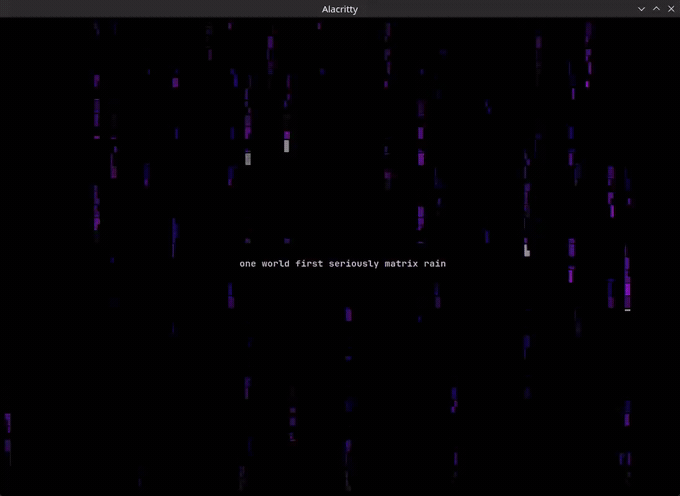
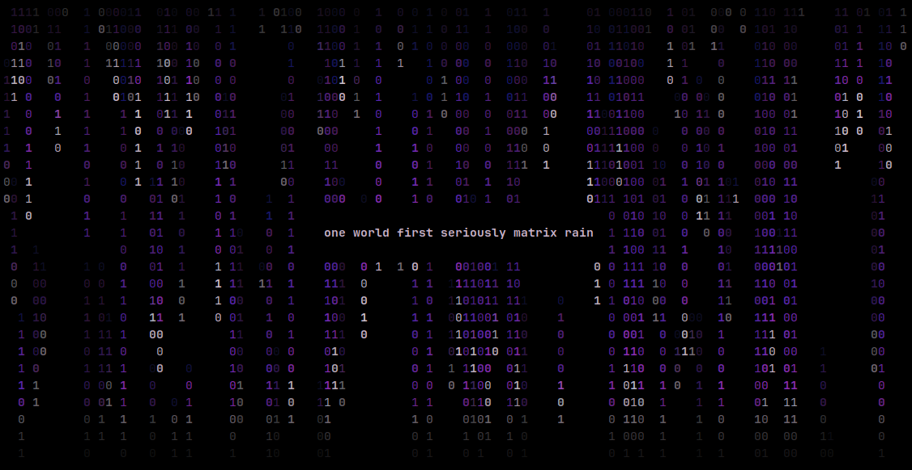
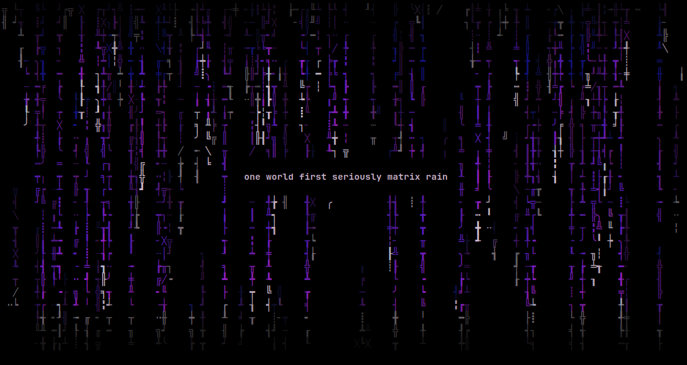

<!-- SPDX-License-Identifier: GPL-3.0-only -->

<p align="center">
  
</p>

<h1 align="center">cosmostrix</h1>

<p align="center">
  <strong>Production-grade cinematic Matrix rain renderer for serious terminal environments.</strong>
</p>

<p align="center">
  Engineered for smooth rendering, configurable atmosphere, clean terminal recovery, and reliable cross-platform operation.
</p>

<p align="center">
  <a href="https://ko-fi.com/rezky">
    
  </a>
</p>

## Demo

<p align="center">
  
</p>

<p align="center">
  
  <br>
  
</p>

<p align="center">
  <a href="assets/cosmostrix-v4-demo.mp4">MP4 demo</a>
  ·
  <a href="https://www.youtube.com/watch?v=KSk-DWFdg3A">YouTube</a>
</p>

Signature Monolith Rain, cinematic themes, and message mode in a real terminal session.

## Features

- **Cinematic terminal rain** — calm, organic, premium visual feel with crisp head/body/trail hierarchy
- **3 scene atmospheres** (matrix, monolith, signal), including signature Cosmostrix Monolith Rain
- **8 curated presets** (classic, cinematic, calm, monolith, storm, cosmos, neon, hacker) for one-command visual profiles
- 43 built-in themes and 24 character set presets
- Phosphor persistence (CRT afterglow), depth fog, and 3-layer parallax
- TrueColor green gradients with luminous head glow
- Configurable speed, density, FPS, and glitch intensity
- Alternate screen with diff-based rendering — no scrollback spam
- Adaptive throttling: reduces CPU usage when idle
- Screensaver mode
- Optional mouse hover/click effects (`--mouse`)
- Safe terminal cleanup and recovery (`--reset-terminal`)
- Cross-platform: Linux, macOS, Windows, Android (Termux)

## Requirements

- Rust stable toolchain to build from source
- A terminal supporting ANSI escape sequences, alternate screen, and raw mode
- Best results with 256-color or truecolor terminals

## Installation

### GitHub Releases (prebuilt binaries)

Download from [Releases](https://github.com/oxyzenQ/cosmostrix/releases), verify the checksum, and place `cosmostrix` in your `PATH`.

Each release ships **three** checksums: classical SHA-512 + quantum-resistant
BLAKE2b-512 + SHAKE256. Full instructions in
[docs/VERIFY_RELEASE.md](docs/VERIFY_RELEASE.md).

```bash
# Classical (universal)
sha512sum -c cosmostrix-vX.Y.Z-linux-amd64-musl.tar.gz.sha512sum

# Quantum-resistant — BLAKE2b (fastest, in coreutils)
b2sum -c cosmostrix-vX.Y.Z-linux-amd64-musl.tar.gz.b2sum

# Quantum-resistant — SHAKE256 (NIST PQ standard, via Python)
# openssl's -shake256 default output length varies; Python is consistent
COMPUTED=$(python3 -c "import hashlib; print(hashlib.shake_256(open('cosmostrix-vX.Y.Z-linux-amd64-musl.tar.gz','rb').read()).hexdigest(64))")
EXPECTED=$(awk '{print $1}' cosmostrix-vX.Y.Z-linux-amd64-musl.tar.gz.shake256)
[ "$COMPUTED" = "$EXPECTED" ] && echo "OK" || echo "FAILED"
```

**Available platforms:**

- Linux amd64: `v3`, `v4`, `musl` (also `linux-aarch64` for arm64)
- macOS: `darwin-aarch64-native` (Apple Silicon)
- Windows: `windows-x86_64`, `windows-aarch64-native`
- Android (Termux): `android-aarch64-native`

```bash
REPO="oxyzenQ/cosmostrix"
TAG="v11.0.0"
PLATFORM="linux-amd64-v3"
curl -LO "https://github.com/${REPO}/releases/download/${TAG}/cosmostrix-${TAG}-${PLATFORM}.tar.gz"
curl -LO "https://github.com/${REPO}/releases/download/${TAG}/cosmostrix-${TAG}-${PLATFORM}.tar.gz.sha512sum"
sha512sum -c "cosmostrix-${TAG}-${PLATFORM}.tar.gz.sha512sum"
tar -xzf "cosmostrix-${TAG}-${PLATFORM}.tar.gz"
./cosmostrix -i
```

### AUR (Arch Linux)

```bash
paru -S cosmostrix-bin    # or: yay -S cosmostrix-bin
```

### From source

```bash
git clone https://github.com/oxyzenQ/cosmostrix.git
cd cosmostrix
cargo install --path .
cosmostrix -i
```

### Optimized local builds

For a modern Linux x86_64 machine, the recommended optimized build is:

```bash
cargo pro-linux-v3
```

Artifact variants use explicit CPU baselines:

| Variant | Baseline |
|---|---|
| `linux-amd64-v3` | AVX2 / BMI2 / FMA-era CPUs (2013+, most modern x86_64) |
| `linux-amd64-v4` | AVX-512 baseline (high-end server/workstation) |
| `linux-amd64-musl` | v3 baseline + statically linked (max portability) |
| `native` | Local-only build tuned for the current CPU |

> **Note:** v1/v2 x86_64 variants were dropped in v11.0.0. Modern CPUs
> (2013+) support v3. For maximum portability (Alpine, containers,
> minimal base images), use the `musl` variant — it's statically linked
> with no glibc dependency.

Release/pro builds keep `panic = "unwind"` on purpose. Cosmostrix owns raw mode,
alternate screen, cursor visibility, and line-wrap state while running; unwinding
lets the RAII terminal guard and panic hook restore the terminal on panic.

To verify an optimized artifact:

```bash
target/x86_64-unknown-linux-gnu/pro-linux-v3/cosmostrix -i
file target/x86_64-unknown-linux-gnu/pro-linux-v3/cosmostrix
scripts/verify-release-build.sh pro-linux-v3
```

## Quickstart

```bash
cosmostrix                           # signature Monolith Rain default
cosmostrix --color rainbow --speed 12   # color + speed
cosmostrix --screensaver              # exit on keypress
cosmostrix --message "wake up, neo"   # overlay message
cosmostrix --charset katakana         # character set
cosmostrix --preset cinematic          # curated preset
cosmostrix --scene monolith --color deepspace
cosmostrix --config ./cosmostrix.conf  # explicit config file
cosmostrix --profile nightcore         # user-defined config profile
```

## CLI Reference

Run `cosmostrix --help` for common options or `cosmostrix --help-detail` for the full reference.

```text
COMMON OPTIONS
  -c, --color <name>        Color theme
     --charset <name>       Character preset
  -f, --fps <1-240>         Target FPS
  -S, --speed <1-100>       Rain speed
  -d, --density <0.01-5.0>  Rain density
  -s, --screensaver         Exit on keypress
     --mouse                Enable mouse hover/click effects
  -m, --message <text>      Overlay message
     --low-power            Power-saving mode
     --glitch-level <level> Glitch intensity (none|subtle|default|intense)
     --preset <name>       Apply a named preset
     --scene <name>        Apply a scene atmosphere
     --profile <name>      Apply a user-defined config profile
     --config <path>        Load config from an explicit file
     --dump-config          Print an example config and exit

DIAGNOSTICS
     --doctor               Compatibility report
     --benchmark            Renderer benchmark
  -i, --info                Build and runtime information
     --reset-terminal       Destructive terminal recovery (clears screen + scrollback)

DISCOVERY
     --list-colors          Show compact color theme names
     --list-charsets        Show available charset presets
     --list-presets         Show available presets
     --list-scenes          Show available scene atmospheres
     --defaults             Show the default runtime profile
```

Explicit CLI flags always override preset, scene, and profile values.

## Runtime Controls

```text
  q / Esc       Quit              p          Pause / resume
  c / C         Cycle theme       s / S      Cycle charset
  x / X         Cycle scene       [ / ]      Density
  Up / Down     Speed             g          Toggle glitch
  m             Cycle profile     Space      Reseed animation
```

## Scenes

- `matrix` — classic Matrix glyph rain
- `monolith` — default signature Cosmostrix Monolith Rain with sparse structured segments
- `signal` — digital transmission / code-signal atmosphere

Press `x` or `X` while running to cycle scenes forward: Monolith Rain → Matrix → Signal → Monolith.

## Configuration

Persistent defaults can be set in `~/.config/cosmostrix/config` (or `$XDG_CONFIG_HOME/cosmostrix/config`). Use `--config <path>` to load a specific file.

```
scene = monolith
preset = cinematic
color = cosmos
charset = binary
fps = 60
speed = 20
density = 0.75
glitch-level = subtle
mouse = false
```

Precedence: defaults → config file → preset/scene/profile layers → explicit CLI flags.

```bash
cosmostrix --dump-config        # print example config
cosmostrix --list-profiles      # list user profiles
cosmostrix --config-path        # print default config path
```

## Terminal Recovery

Quit with `q`, `Esc`, or Ctrl+C when possible. If a terminal is left in raw mode or alternate screen:

```bash
cosmostrix --reset-terminal
```

On Windows PowerShell: `.\cosmostrix.exe --reset-terminal`

For terminal behavior, background modes, tmux/SSH notes, and Windows recovery expectations, see [Terminal Compatibility](docs/TERMINAL_COMPATIBILITY.md).

## Benchmarking

Benchmark results are machine-dependent. Use them to compare builds on the same machine, not as portable performance promises. Optimized builds remain comfortably above the 60 FPS target.

```bash
cargo pro-linux-v3
COSMOSTRIX_BENCH_COLS=120 COSMOSTRIX_BENCH_LINES=40 \
  target/x86_64-unknown-linux-gnu/pro-linux-v3/cosmostrix --benchmark
```

See [benchmark/README.md](benchmark/README.md) for full reference results and interpretation notes.

### v11.0.0 Performance & Cinematic Peak

Three optimization phases + pre-release audit + I/O bottleneck research + final bottleneck hunt yielded **+40.5% FPS** improvement over v5.0.3 (cumulative **+83.3%** from v5.0.1):

| Metric | v5.0.3 | v11.0.0 | Improvement |
|---|---|---|---|
| avg_fps | 27,869 | 39,147 | **+40.5%** |
| peak_fps | 42,801 | 55,451 | **+29.6%** |
| avg_frame_time | 0.035ms | 0.025ms | -28.6% |
| p99_frame_time | 0.046ms | 0.030ms | -34.8% |
| p95_frame_time | 0.042ms | 0.028ms | -33.3% |

Key optimizations: O(1) phosphor dedup (BitVec), head_brightness hoist,
DrawCtx glitch cache, viewport_edge_fade LUT, spawn free-list, flat
terminal dirty pairs, direct ANSI byte buffer (bypass crossterm),
combined fg+bg SGR, no-heap integer formatting. See
[benchmark/README.md](benchmark/README.md) for full details.

## Roadmap

### v11.0.0 — Cinematic Peak (current)
- ✅ +70.3% FPS via hot-path + structural optimization
- ✅ Brutal pre-release audit: panic hook race, SIGQUIT, overflow guards
- ✅ GPL-3.0-only enforced across all 171 files
- ✅ Lightning feature removed (never reached satisfying visual feel)
- ✅ Dead code removed, memory ordering fixed, defense-in-depth added

### Future Directions

**Investigated and ruled out:**
- ~~SoA/SIMD/multi-core~~: Not viable (wrong access pattern, 0.1% budget used)

**Real bottleneck: terminal I/O (optimized in v11.0.0)**
- Direct ANSI byte buffer bypasses crossterm `.queue()` overhead
- Combined fg+bg SGR, no-heap integer formatting, single flush per frame

**Remaining I/O research (post-v11.0.0):**
- Terminal protocol detection (kitty/foot/wezterm), color byte caching, output compression

## Version & Updates

```bash
cosmostrix -V
cosmostrix --version
cosmostrix --check-update
```

`-V` and `--version` print the complete version, build target, commit, license, and source repository. `--check-update` is read-only and checks the latest upstream GitHub release without downloading or replacing binaries.

## Documentation

- [Changelog](CHANGELOG.md) — release history
- [Terminal Compatibility](docs/TERMINAL_COMPATIBILITY.md) — terminal behavior, tmux/SSH, recovery
- [Visual Stability](docs/VISUAL_STABILITY.md) — visual depth and throughput stability
- [Endurance](docs/ENDURANCE.md) — endurance testing and resource monitoring
- [Atmosphere Engine](docs/ATMOSPHERE_ENGINE.md) — atmosphere and whisper engine internals
- [Supply Chain](docs/SUPPLY_CHAIN.md) — supply-chain hardening policy
- [Stability Audit](docs/STABILITY_AUDIT.md) — terminal stability audit
- [SIMD Feasibility](docs/SIMD_FEASIBILITY.md) — SIMD optimization feasibility
- [Zactrix Core](docs/ZACTRIX_CORE.md) — internal Zactrix Core architecture
- [Zactrix Engine](docs/ZACTRIX_ENGINE.md) — Zactrix engine design
- [Zactrix Cache](docs/ZACTRIX_CACHE.md) — Zactrix cache layer
- [CI & Release Workflow](docs/workflow/about-ci.md) — CI pipeline and release process

## Development

```bash
cargo fmt --all
cargo clippy --locked --all-targets --all-features -- -D warnings
cargo test --all --locked
scripts/verify-release-build.sh pro-linux-v3 pro-linux-v4 pro-linux-musl
```

## Release Process

Create a release by pushing a `v*` tag. See [docs/workflow/about-ci.md](docs/workflow/about-ci.md) for CI and release workflow details.

## Contributing

PRs and issues are welcome. Please run `cargo fmt` and `cargo clippy` before submitting. See [RULES.md](docs/RULES.md) for project conventions.

## Support

cosmostrix is an open-source project built and maintained independently by [rezky_nightky (oxyzenQ)](https://github.com/oxyzenQ).

If this project helped you, or saved development time, you can support future maintenance here:

[](https://ko-fi.com/rezky)

Support is optional. The project remains open-source.

## Intellectual Property & Trademark

**cosmostrix** is the exclusive intellectual property of **rezky_nightky (oxyzenQ)**. Source code: **GPL-3.0-only** (see [LICENSE](LICENSE)). Name, logo, and branding ("the Marks") are governed by [TRADEMARK.md](TRADEMARK.md), are NOT covered by the GPL, and are reserved by the owner. This project is **NOT for sale**; unauthorized rebranding, relicensing, or source-code theft is strictly prohibited. For trademark licensing or written permission, contact **rezky_nightky (oxyzenQ)** — https://github.com/oxyzenQ.
© 2026 rezky_nightky (oxyzenQ). All rights reserved.
