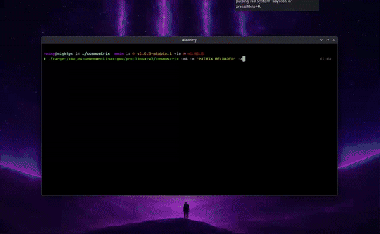

<p align="center">
  
</p>

<h1 align="center">cosmostrix</h1>

<p align="center">
  <strong>A production-grade cinematic Matrix rain renderer for serious terminal environments.</strong>
</p>

<p align="center">
  Engineered for smooth rendering, configurable atmosphere, clean terminal recovery, and reliable cross-platform operation.
</p>

<p align="center">
  <a href="https://ko-fi.com/rezky">
    
  </a>
</p>

## Demo

<p align="center">
  
</p>

<details>
<summary>Watch full video demo (38s)</summary>

<video src="assets/cosmostrix-long-endurance.mp4" autoplay loop muted playsinline width="100%"></video>

</details>

[Watch on YouTube](https://www.youtube.com/watch?v=KSk-DWFdg3A)

## Features

- **Cinematic terminal rain** — calm, organic, premium visual feel with crisp head/body/trail hierarchy
- **3 scene atmospheres** (matrix, monolith, signal) for v3 scene-based atmosphere selection
- **8 curated presets** (classic, cinematic, calm, monolith, storm, cosmos, neon, hacker) for one-command visual profiles
- 43 built-in color themes and 24 character set presets
- Phosphor persistence (CRT afterglow), depth fog, and 3-layer parallax
- TrueColor green gradients with luminous head glow
- Configurable speed, density, FPS, and glitch intensity
- Alternate screen with diff-based rendering — no scrollback spam
- Adaptive throttling: reduces CPU usage when idle
- Screensaver mode
- Optional mouse hover/click effects (`--mouse`)
- Safe terminal cleanup and recovery (`--reset-terminal`)
- Cross-platform: Linux, macOS, Windows, Android (Termux)

## Requirements

- Rust stable toolchain to build from source
- A terminal supporting ANSI escape sequences, alternate screen, and raw mode
- Best results with 256-color or truecolor terminals

## Quickstart

```bash
# Run from source
cargo run --release

# Build a release binary
cargo build --release

# Run with a color scheme
./target/release/cosmostrix --color rainbow --speed 12
```

## Installation

### GitHub Releases (prebuilt binaries)

Download from [Releases](https://github.com/oxyzenQ/cosmostrix/releases), verify the checksum, and place `cosmostrix` in your `PATH`.

**Available platforms:**

- Linux x86_64: `v1` (compatible), `v2`, `v3`, `v4`
- macOS: `darwin-aarch64-native` (Apple Silicon)
- Windows: `windows-x86_64`, `windows-aarch64-native`
- Android (Termux): `android-aarch64-native`

```bash
REPO="oxyzenQ/cosmostrix"
TAG="v3.0.0"
PLATFORM="linux-x86_64-v3"
curl -LO "https://github.com/${REPO}/releases/download/${TAG}/cosmostrix-bin-${TAG}-${PLATFORM}.tar.gz"
curl -LO "https://github.com/${REPO}/releases/download/${TAG}/cosmostrix-bin-${TAG}-${PLATFORM}.tar.gz.sha512"
sha512sum -c "cosmostrix-bin-${TAG}-${PLATFORM}.tar.gz.sha512"
tar -xzf "cosmostrix-bin-${TAG}-${PLATFORM}.tar.gz"
./cosmostrix -i
```

### AUR (Arch Linux)

```bash
paru -S cosmostrix-bin    # or: yay -S cosmostrix-bin
```

### From source

```bash
git clone https://github.com/oxyzenQ/cosmostrix.git
cd cosmostrix
cargo install --path .
cosmostrix -i
```

### Optimized local builds

For a modern Linux x86_64 machine, the recommended optimized build is:

```bash
cargo pro-linux-v3
# equivalent:
COSMOSTRIX_BUILD=linux-x86_64-v3 COSMOSTRIX_PROFILE=pro-linux-v3 \
  RUSTFLAGS="-C target-cpu=x86-64-v3" \
  cargo build --profile pro-linux-v3 --target x86_64-unknown-linux-gnu
```

Do not use plain `cargo build --profile pro-linux-v3 --target x86_64-unknown-linux-gnu`
for release artifacts. Stable Cargo profiles cannot store per-profile
`target-cpu` flags, so that command is only a profile build, not a CPU-tuned
v3 build. Official aliases and release jobs set `COSMOSTRIX_BUILD`,
`COSMOSTRIX_PROFILE`, and matching `RUSTFLAGS`; if those claimed metadata values
and Cargo's compile-time target features disagree, the build fails.

Artifact variants use explicit CPU baselines:

- `linux-x86_64-v1`: maximum x86_64 compatibility
- `linux-x86_64-v2`: newer baseline with SSE4.2/POPCNT-era CPUs
- `linux-x86_64-v3`: AVX2/BMI2/FMA-era CPUs
- `linux-x86_64-v4`: AVX-512 baseline
- `native`: local-only build tuned for the current CPU; not used for distributed Linux x86_64 artifacts

Release/pro builds keep `panic = "unwind"` on purpose. Cosmostrix owns raw mode,
alternate screen, cursor visibility, and line-wrap state while running;
unwinding lets the RAII terminal guard and panic hook restore the terminal on
panic. Mouse reporting is off by default and is enabled only with `--mouse`.

To verify an optimized artifact:

```bash
target/x86_64-unknown-linux-gnu/pro-linux-v3/cosmostrix -i
file target/x86_64-unknown-linux-gnu/pro-linux-v3/cosmostrix
readelf -S target/x86_64-unknown-linux-gnu/pro-linux-v3/cosmostrix | grep -E '\.debug|\.symtab'
scripts/verify-release-build.sh pro-linux-v3
```

## Usage

```bash
cosmostrix                           # default settings
cosmostrix --color rainbow --speed 12   # color + speed
cosmostrix --screensaver              # exit on keypress
cosmostrix --message "wake up, neo"   # overlay message
cosmostrix --charset katakana         # character set
cosmostrix --low-power                # power-saving mode
cosmostrix --mouse                    # opt-in mouse hover/click effects
cosmostrix --preset cinematic          # curated preset
cosmostrix --preset calm               # gentle ocean rain
cosmostrix --preset storm --fps 60     # preset with explicit override
cosmostrix --scene matrix              # v2-compatible default scene
cosmostrix --scene monolith            # dark calm atmosphere
cosmostrix --scene signal --fps 60     # code-signal scene with FPS override
cosmostrix --scene monolith --color deepspace
cosmostrix --config ./cosmostrix.conf  # explicit config file
cosmostrix --dump-config               # print example config
```

## CLI options

Run `cosmostrix --help` for common options or `cosmostrix --help-detail` for the full reference.

```text
COMMON OPTIONS
  -c, --color <name>        Color theme
     --charset <name>       Character preset
  -f, --fps <1-240>         Target FPS
  -S, --speed <0.001-1000>  Rain speed
  -d, --density <0.01-5.0>  Rain density
  -s, --screensaver         Exit on keypress
     --mouse                Enable mouse hover/click effects
  -m, --message <text>      Overlay message
     --low-power            Power-saving mode
     --glitch-level <level> Glitch intensity (none|subtle|default|intense)
     --preset <name>       Apply a named preset (see --list-presets)
     --scene <name>        Apply a scene atmosphere (see --list-scenes)
     --config <path>        Load config from an explicit file
     --dump-config          Print an example config and exit
     --config-path          Print the default config path and exit

DIAGNOSTICS
     --doctor               Compatibility report
     --benchmark            Renderer benchmark
  -i, --info                Build and runtime information
     --reset-terminal       Restore terminal modes after an interrupted run

DISCOVERY
     --list-colors          Show compact color theme names
     --list-colors-detail   Show grouped theme descriptions and aliases
     --list-charsets        Show available charset presets
     --list-presets         Show available presets
     --list-scenes          Show available scene atmospheres
     --defaults             Show the default runtime profile
```

Explicit CLI flags always override preset and scene values. For example, `cosmostrix --scene signal --fps 60` applies the signal scene but keeps FPS at 60.

## Runtime controls

```text
  q / Esc       Quit              p          Pause / resume
  c / C         Cycle theme       s / S      Cycle charset
  [ / ]         Density           Up / Down  Speed
  g             Toggle glitch     m          Cycle profile
  Space         Reseed animation
```

## Terminal Recovery

Quit with `q`, `Esc`, or Ctrl+C when possible. From another shell, prefer:

```bash
pkill -TERM -x cosmostrix
```

Use SIGKILL only as an emergency because no program can restore terminal state
after `kill -9`:

```bash
pkill -KILL -x cosmostrix
```

Avoid `kill -9 $(pgrep -af cosmostrix)` because `pgrep -af` prints command text
as well as PIDs, which can pass non-PID words to `kill`.

If a terminal is left in raw mode, alternate screen, hidden cursor, focus
reporting, or mouse reporting, run:

```bash
cosmostrix --reset-terminal
```

or, if `cosmostrix` is not available:

```bash
printf '\033[?1000l\033[?1002l\033[?1003l\033[?1006l\033[?1015l\033[?2004l\033[?1004l\033[?1049l\033[?25h\033[0m'
stty sane
reset
```

## Config file

Persistent defaults can be set in `~/.config/cosmostrix/config` (or `$XDG_CONFIG_HOME/cosmostrix/config`). Use `--config <path>` to load a specific file.

```
scene = matrix
preset = cinematic
color = cosmos
charset = binary
fps = 60
speed = 8
density = 1
glitch-level = default
color-bg = transparent
low-power = false
mouse = false
fullwidth = false
```

Print a complete copy-pasteable template or the default path with:

```bash
cosmostrix --dump-config
cosmostrix --config-path
```

Precedence is:

1. Built-in defaults
2. Config file values
3. Config preset
4. Config scene
5. CLI preset
6. CLI scene
7. Low-power values when requested, for fields not touched by curated layers or explicit CLI
8. Explicit CLI flags

So `cosmostrix --config ./config --preset storm --scene signal --fps 60` uses the config file, applies the CLI preset, then applies the CLI scene over overlapping curated fields, and keeps FPS at the explicit CLI value `60`.

## Scenes

3 scene atmospheres are available:

- `matrix` — default v2-compatible Matrix rain
- `monolith` — dark, calm, heavy premium atmosphere
- `signal` — digital transmission / code-signal atmosphere

```bash
cosmostrix --scene matrix
cosmostrix --scene monolith
cosmostrix --scene signal
cosmostrix --scene signal --fps 60
cosmostrix --scene monolith --color deepspace
```

## Color schemes

43 built-in themes are available. Run `--list-colors` for the compact canonical list, or `--list-colors-detail` for grouped descriptions and aliases. Existing color names and aliases remain supported, including space-themed sets such as cosmos, nebula, stars, aurora, galaxy, supernova, blackhole, and deepspace.

## Character sets

24 presets available. Run `--list-charsets` to see all (binary, matrix, katakana, braille, cyberpunk, hacker, and more).

## Performance & benchmarking

Benchmark results are machine-dependent. Use them to compare builds on the
same machine, not as portable performance promises. Current optimized builds
remain comfortably above the 60 FPS target in headless simulation; real
interactive rendering is usually limited by the terminal emulator, compositor,
font rendering, and display refresh rate.

Quick benchmark:

```bash
cargo pro-linux-v3
COSMOSTRIX_BENCH_COLS=120 COSMOSTRIX_BENCH_LINES=40 \
  target/x86_64-unknown-linux-gnu/pro-linux-v3/cosmostrix --benchmark
```

See `benchmark/README.md` for full reference results, reproduction steps, and
interpretation notes.

## Release notes

### v2.2.0

**Stability, maintainability, and supply-chain hardening release.** No visual or CLI behavior changes.

- All `*.rs` files are under 1,000 gross lines (enforced by `check-rs-loc.sh` in `check-all`)
- Module splits: `src/cloud.rs` → `src/cloud/` (8 modules), `src/interactive.rs` → `src/interactive/` (6 modules), `src/main.rs` → `src/app.rs` + `src/cli.rs` + `src/info.rs` + `src/main.rs`
- Cloud tests split into `tests/mod.rs` (core) and `tests/tests_phosphor.rs` (phosphor/ghost)
- Added endurance testing documentation ([ENDURANCE.md](docs/ENDURANCE.md)) and resource summary script
- Added supply-chain hardening policy ([SUPPLY_CHAIN.md](docs/SUPPLY_CHAIN.md))
- Added terminal stability audit ([STABILITY_AUDIT.md](docs/STABILITY_AUDIT.md))
- Fixed clippy module-inception and unused import warnings
- Regression suite passes, clippy clean, fmt clean

### v2.1.0

**Visual contrast & readability overhaul** — body glyphs are now clearly readable with stronger head/body/trail hierarchy while preserving the calm cinematic identity.

- Tuned exponential trail decay (K: 3.0 → 1.8) for readable body glyphs across the full trail length
- Raised parallax brightness (far: 35→55%, mid: 80→90%) so depth layers are visible, not invisible
- Increased phosphor residual energy (120→160) for more visible CRT afterglow fadeout
- Extended head linger duration (100→300ms) for smoother cinematic head fade
- Added head self-bloom (12% white blend) making the head clearly the brightest element
- Softer head brightness mapping (0.5+0.5×hb → 0.7+0.3×hb) preventing abrupt head disappearance
- Raised luminance climate minimum (60→75%) and saturation minimum (50→70%) to prevent muddy/dim periods
- Raised fog vignette minimum (25→35%) to keep edge glyphs faintly visible
- Reduced far-layer glyph dimming (30→15%) — already dim from parallax brightness
- TrueColor green palettes now use 24-bit RGB gradients instead of ANSI 256-color indices, with proper bright green head instead of cyan-white
- Reduced profile luminance offsets (Monolith: -0.1→0, Void: -0.2→-0.1, Decay: -0.15→-0.05, Static: -0.25→-0.1)

**Safety & hardening fixes:**

- Tab key safely ignored (was toggling shading mode, causing ghost background glyph flood)
- Paste safety (bracketed-paste burst suppression ignores shortcut letters during paste)
- Pause/resume with cinematic smoothstep easing (no snap on resume)
- Color and charset transitions use cinematic top-to-bottom wave propagation
- Mouse mode default-off, opt-in with `--mouse`
- Bottom-row phosphor decay acceleration prevents "concrete wall" accumulation
- Ghost glyph threshold prevents stale charset from filling background on full redraw
- Safe terminal cleanup on all exit paths (RAII guard + `--reset-terminal`)

### v2.0.0

- Fixed stale glyph artifacts in the top visible rows during charset and theme changes.
- Fixed long-idle rain/trail resync issues with wall-clock redraw scheduling and focus/input redraw resync.
- Clarified benchmark dirty-cell and color-mode metrics so differential rendering reports are easier to interpret.
- Fixed direct-color auto-detection for `xterm-direct` and `tmux-direct`.
- Removed unused low-value support code while preserving rendering behavior.
- Completed 10h+ visual soak checks across Alacritty, Konsole, and WezTerm.
- Resource monitoring found no memory, file descriptor, thread, swap, CPU, or IO leak during the release soak.

## Versioning

Cosmostrix uses SemVer for package versions, e.g. `3.0.0`.
Git tags and GitHub Releases use a leading `v`, e.g. `v3.0.0`.
Stable releases do not use `-stable.N` suffixes.

## Development

```bash
cargo fmt --all
cargo clippy --locked --all-targets --all-features -- -D warnings
cargo test --all --locked
scripts/verify-release-build.sh pro-linux-v1 pro-linux-v2 pro-linux-v3
```

## Release process

Create a release by pushing a `v*` tag. See `workflow/about-ci.md` for CI and release workflow details.

## Contributing

PRs and issues are welcome. Please run `cargo fmt` and `cargo clippy` before submitting. See [RULES.md](RULES.md) for project conventions.

## Support

cosmostrix is an open-source project built and maintained independently.

If this project helped you, or saved development time, you can support future maintenance here:

[](https://ko-fi.com/rezky)

Support is optional. The project remains open-source.

## License

MIT. See `LICENSE`. Brand usage governed by `TRADEMARK.md`.
