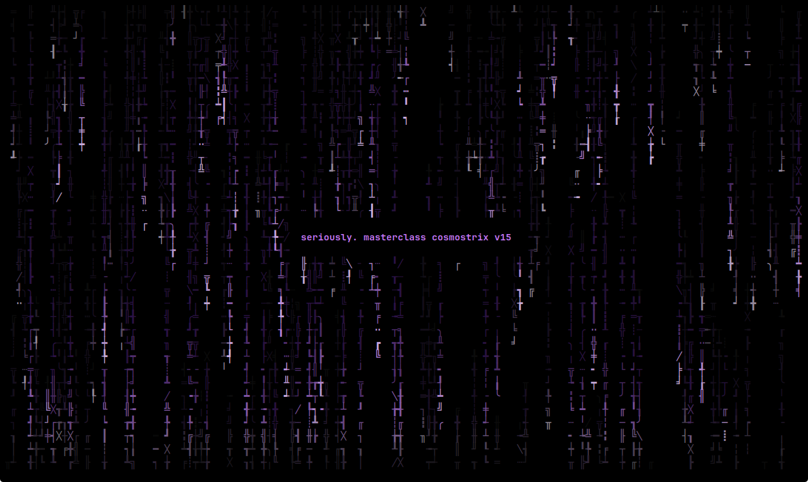

<!-- SPDX-License-Identifier: GPL-3.0-only -->

<p align="center">
  
</p>

<h1 align="center">cosmostrix</h1>

<p align="center">
  <strong>Professional-grade cinematic Matrix rain renderer for serious terminal environments.</strong>
</p>

<p align="center">
  <strong>The Cosmic Dragon</strong> diff-based renderer + <strong>The Chroma Dragon</strong> perceptual color pipeline + <strong>The Crystal Dragon</strong> ambient intelligence.
</p>

<p align="center">
  <em>Experience a masterpiece with cosmostrix.</em>
</p>

<div align="center">

> Think you can beat cosmostrix? Go ahead -- no force needed.\
> But when you enter the rain, you'll feel the depth --\
> and you'll understand why the dragon never loses.

</div>

<p align="center">
  <a href="https://ko-fi.com/rezky">
    
  </a>
</p>

## Demo

<p align="center">
  
</p>

<p align="center">
  
  <br>
  
  <br>
  
  <br>
  
  <br>
  
</p>

<p align="center">
  <a href="https://www.youtube.com/watch?v=KSk-DWFdg3A">YouTube</a>
</p>

Signature Cinematic Cosmic, Monolith Rain, and message mode in a real terminal session.

## About — Three Dragon Engines

cosmostrix is built on **three cooperating engines** that split the work along clean boundaries: *what cells changed* (Cosmic Dragon), *what color a cell becomes* (Chroma Dragon), and *what mood the rain should have* (Crystal Dragon).

### The Cosmic Dragon Diff-Based Rendering Engine

Lives under `src/engine/cosmic_dragon_engine/` — imported by every render-path module. Owns the **diff-based render loop**: a persistent back-buffer of `Cell` values is compared frame-to-frame, and only changed cells are emitted as ANSI escape sequences (with RLE batching on consecutive dirty cells in the same row). On a typical 120×40 terminal that means ~360 cell-writes per frame instead of 4,800 — a 13× reduction in I/O that compounds with screen size. At 400×200 (80,000 cells) the savings exceed 90%.

This is what makes the cinematic effects affordable: phosphor decay, 3-layer parallax, value-noise density, and atmospheric modulation all stack on top of a render path that already only writes the cells that changed. Without the diff engine, those effects would be unrenderable.

### The Chroma Dragon Coloring Engine

Lives under `src/engine/chroma_dragon_engine/`. Owns every decision about *what color a cell becomes*. Where the Cosmic Dragon asks "did this cell change?", the Chroma Dragon answers "what color should it be now?"

The Chroma Dragon is locked at **Phase 9-D** — the culmination of the perceptual color work: OKLab gradient interpolation (no muddy mid-tones on hue-crossing gradients), hue-preserving polar gradients, palette-relative brightness floor, body-tail brightness continuity, head halo + subpixel hue jitter, and palette transitions that sweep through perceptual space instead of hard-snapping. A lock suite of invariant tests asserts the engine's public contract on every commit.

See `cosmostrix --docs` for the full technical breakdown, or run `cargo test lock -- --nocapture` to print the engine lock report.

### The Crystal Dragon Ambient Intelligence Engine

Lives under `src/engine/crystal_dragon_engine/`. Owns *what mood the rain should have* — ambient palette drift from system state (`--crystal-dragon`), time-of-day scene scheduling via `ambient."HH-MM" = "scene"` config entries, and point-based temperature grouping with OKLab smooth transitions.

## Architecture

cosmostrix is **not a clone**. The Cosmic Dragon engine computes only the ~7.5% of cells that change between frames, rather than redrawing the entire screen. This enables cinematic effects — phosphor decay, 3-layer parallax, value-noise density — at practical terminal-bounded FPS (60–240 on Alacritty/kitty/WezTerm) while using only **~4–5 MiB of RAM** and a single CPU core. No GPU. No bloat.

The renderer is structured as six cooperating subsystems:

1. **Diff-based cell renderer** (`src/engine/cosmic_dragon_engine/`) — back-buffer comparison, RLE-batched ANSI output, dirty-region tracking. The core innovation. On a 120×40 terminal: ~360 cell-writes per frame instead of 4,800 (13× I/O reduction).
2. **3-layer parallax** — far / mid / near layers with independent speed, brightness, length, density, and phosphor-decay multipliers. Three layers is the cinema-standard composition; more would collapse perceptually in a 24-row terminal.
3. **Phosphor persistence** (`src/engine/cosmic_dragon_engine/cloud/phosphor.rs`) — CRT afterglow with per-layer decay multipliers and bottom-row acceleration. Creates ~400 ms afterglow per glyph.
4. **Density noise & wind gusts** — Perlin-style value-noise density for organic rain distribution, gust-driven column acceleration.
5. **Ambient scheduler** (`src/engine/crystal_dragon_engine/ambient_scheduler/`) — time-of-day scene scheduling with auto-snapback (idle 30s restores the active ambient phase).
6. **Chroma Dragon coloring engine** (`src/engine/chroma_dragon_engine/`) — OKLab gradient interpolation, cell-color resolution, transition smoothing, palette-aware anomaly halos. Locked at Phase 9-D.

Run `cosmostrix --docs` for the full technical breakdown, or `cosmostrix --benchmark` for performance measurements on your own hardware.

## Philosophy — Not a Toy, But a Masterpiece

cosmostrix is powered by three Dragon Engines — serious rendering, color, and ambient intelligence systems, not a hobbyist project or a toy. They stand in relation to ordinary Matrix rain renderers the way the *Mona Lisa* stands to a paint-by-numbers kit: same medium, completely different discipline.

Every design decision is governed by one question: *does this serve the cinematic aesthetic?* Features that compromise that aesthetic are rejected on principle.

- **No emoji. No wide characters. No colorful pictograms in the rain.** The rain speaks in glyphs: katakana, binary, hacker charset, cosmic runes. This is a permanent design constraint, not a missing feature.
- **Diff-based rendering is the innovation, not a gimmick.** Near-zero per-frame heap allocation (0.0 allocs/frame on the lean path, ~1.1 on the production-draw I/O path). On a 2-vCPU cloud Xeon the `monolith` scene sustains ~100K avg_fps at 80×24 (pro-linux build, headless dry I/O) — far above the 60 FPS interactive cap. This is what makes the cinematic effects affordable.
- **Perceptual color, not RGB math.** The Chroma Dragon interpolates palettes in OKLab space (perceptually uniform) and smooths palette transitions through the polar chroma ring (hue-preserving). No muddy midpoints, no hard color seams.
- **CPU-only by choice.** The terminal is a text medium — ANSI escape sequences and copy-pasteable glyphs. GPU image-mode was evaluated and explicitly rejected.
- **Exclusive by design.** cosmostrix pursues depth — phosphor physics, ambient intelligence, endurance telemetry, perceptual color — that no toy would attempt.

The Dragon's roar is not loud — it is precise.

## Features

### Rendering

- **Cosmic Dragon diff-based rendering engine** — double-buffered dirty tracking with O(1) clear, semantic generation invalidation, `/dev/tty` fallback, single-syscall flush, and pre-formatted SGR bytes (0.0 allocs/frame on lean path). Invariant tests lock the engine's contract on every commit.
- **Chroma Dragon coloring engine (Phase 9-D locked)** — OKLab gradient interpolation, palette-relative brightness floor, body-tail continuity, perceptual transition smoothing, head halo, subpixel hue jitter, temporal column coherence, and hue-preserving polar gradient. Invariant tests lock the engine's contract on every commit.
- **3-layer parallax depth** — far/mid/near layers with independent speed, brightness, length, density, and phosphor-decay multipliers.
- **Phosphor persistence (CRT afterglow)** — per-layer decay with bottom-row acceleration, creating ~400ms afterglow per glyph.
- Per-layer contrast reduction for depth-of-field perceptual blur.
- TrueColor gradients with luminous head glow.
- **CRT vignette** — top/bottom edge dim for cinematic CRT-glow feel; auto-disabled under performance pressure.
- **Quantum ripple** — click-triggered expanding particle burst at the click point; bounded pool prevents unbounded spawn.
- **Ghost-kanji cinematic events** — probabilistic ghost characters that fade in/out during rain, palette-aware (match the active scene's color).
- **Entropy drift + emergent storytelling** — slow autonomous luminance shifts, density migration, and anomaly pressure fluctuations that make the renderer feel atmospherically alive across long sessions.
- Color ecosystem with luminance/saturation/hue climate drift (orthogonal to Crystal Dragon palette selection).
- Configurable speed, density, FPS, and glitch intensity.
- Message overlay — display custom text on the rain (`-m "wake up, neo"`, `-mb` for border). Also configurable in `config.toml` via `message` / `message-border` keys; interactive mode defaults to a bordered "cosmostrix v<VERSION>" overlay when neither CLI nor config provides one; `msg-mode = false` (or `--msg-mode false`) disables the overlay, and CLI `-m`/`-mb` always win over it. The reveal animation is selectable via `-mfs`/`--msg-fill-style` (typewriter|fade|words|slide|instant|engrave|hologram|glitch|scorch|cascade, default engrave — v80.0.0-beta.2 owner champion) or the `msg-fill-style` config key. Every style is a distinct cinematic reveal — laser burn-in, hologram projection with CRT scanline, Matrix-decode glyph glitch, ember scorch with smoke, left-to-right cascade — and all of them respect `--no-effects`. Run `--help` for the full per-style breakdown.
- Alternate screen with diff-based rendering — no scrollback spam, RLE batched output.
- **Smooth pause** — `p` toggles pause with the unified **exponential decay** easing family (consistent across pause/resume + glyph scene entry): ~2.5s coast-down to settle, ~3.3s wake-up ramp on resume; rain, particles, and events freeze gracefully. A rapid `p` tap during the coast-down aborts the pause and ramps back from the current speed with a fast recovery curve — no snap, no stuck-feel — and the wind-gust and cinematic event clocks resume exactly where they froze (NIGHT-hunter-8). Resume is also phase-continuous per droplet: every head's brightness ramp and row-advance phase are preserved frozen mid-step and continue exactly where they stopped (NIGHT-hunter-28 — no brightness reshuffle pop at high detail), and the structured families honor the phosphor ownership rule: a cell the family still draws is owned by the draw and never decayed into a ghost by the afterglow pass, so the whole field (the black hole's ball and disk included) holds rock-steady through the freeze and wakes without the full-population brightness strobe the owner reported on sorgonemous_intrascals (NIGHT-hunter-29). While paused, ONLY `p` (resume) and `q` (quit) respond — every other shortkey is ignored — and all running HUD metrics freeze at their last active value, resuming with precision (uptime excludes the paused span; paused input-poll ticks never contaminate the fps/p99/ehs windows).

### Scenes & Colors

- **Built-in scenes** — core atmospheres, curated scenes, and milestone/tribute/honor scenes. The full list with each scene's character lives in [Scenes](#scenes) below.
- **User-defined custom scenes** — `[scene-custom.<name>]` blocks in config, applied via `--scene <name>` (auto-promotes custom names) or `--scene-custom <name>`, or the `scene = "<name>"` config key. v80.0.0-beta.2 (S-master-LOGIC-3) + NIGHT-research-5: a block is a COMPLETE seven-dimension profile — `rain`, `color`/`colors-custom`, `charset`/`charset-custom`, `fps`, `speed`, `density`, `glitch-level`, ALL required (incomplete blocks are rejected); `rain` picks any of the fourteen rain styles by canonical label (`glyph`, `monolith`, `vortex`, `flux`, `lorenz`, `dragon`, `physarum`, `black_hole`, `aeolian`, `solar_flare`, `dna_helix`, `murmuration`, `quasar`, `neural` — e.g. `rain = "lorenz"`); `base-scene` inheritance is REMOVED (the block's `rain` field is the only non-glyph source); all three selection surfaces (CLI flags, config key, live-reload edit) accept custom names uniformly, and at runtime a present block field overrides the locked CLI startup value (config wins — the CLI lock is only the fallback).
- **Custom color palettes** — `[colors-custom.<name>]` blocks define 2–10-stop TrueColor palettes; referenced via `--colors <name>`, the `color = "<name>"` config key (custom names accepted, same as charset — v80.0.0-beta.2), or from scenes.
- **Custom charsets** — `[charset-custom.<name>]` blocks define character sets from Unicode ranges; referenced via `--charset <name>`.
- Dozens of built-in color themes and character sets (`--list-colors` / `--list-charsets` print the live catalog).
- **Color tune** (`--color-tune sat,bright,head,body,tail`) — per-channel multiplier (default 1.0 = identity) that turns every built-in theme into infinite variants.

### Intelligence & Power

- **Crystal Dragon Engine** — ambient intelligence for palette drift from system state (`--crystal-dragon`), point-based temperature grouping (Cold/Medium/Hot) with OKLab smooth transitions.
- **Ambient scheduler** — time-of-day scene switching via `ambient.HH-MM = <scene>` in config. A dynamic idle/wake scheduler thread spends zero CPU between phase boundaries. Crystal Dragon drift overrides the ambient palette, and the ambient snapback reverts it after `ambient-snapback-secs` — the two systems cooperate by taking turns. Both timing knobs are tunable online (`ambient-snapback-secs` and `--crystal-dragon-secs` / `crystal-dragon-secs`, 0.0..=86400.0, default 60, human forms accepted: `45`, `45s`, `1m`, `1h30m` — one vocabulary across CLI and config; keep snapback < polling for the cleanest take-turns rhythm — the owner's verified pair is 15s + 10s). When ambient is off, Crystal Dragon drifts on its own cadence with a self-resetting cycle. See `docs/AMBIENT_SCHEDULER.md` "Usage Quick Guide" for the timing recipes.
- **Self-healer** — P1 auto scene downgrade (switches to `low-power` under sustained pressure, restores when pressure drops) and P2 endurance health mitigation (full redraw + memory reclaim hints).
- **Endurance subsystem** — activity prediction, idle coalescing, memory reclaim hints (Linux `madvise`), and Endurance Health Score (0–100) for long-running sessions.
- **Power Dragon** — adaptive throttling reduces CPU when idle (30s no-input -> 0.5× FPS). Thermal pressure tracking feeds into the self-healer. With it on, the HUD `dsty:` line shows the EFFECTIVE (pressure-banded) density — `density = 0.90` can display ~0.65 under moderate pressure; `power-dragon = false` (or `--power-dragon false`) pins the exact configured value.
- **Terminal tier detection** — auto-detects xterm.js hosts (VSCode, web terminals) and caps FPS at 30 to prevent OOM; native terminals get up to 240 FPS.

### Live Reload & Config

- **Live config reload** — `notify`-based hybrid filesystem watcher (inotify/kqueue/FSEvents) with bounded channel (cap 64). On save: strict validation -> full `CloudConfig` rebuild -> atomic apply. Works for all config sections (scenes, colors, charsets, profiles, ambient, crystal-dragon). Half-write safe with atomic editors (VSCode, vim, etc.).
- Terminal diagnostics (`--doctor`) and config validation (`--testconf`).

### Interaction & UX

- Always-on mouse glow + click wave effects (cursor halo + dual-ring shockwave + quantum ripple particles). Mouse reporting always active (blocks text selection).
- Live HUD — real-time FPS, p99, frame-time, RSS, endurance health, and build info (toggle with `i`).
- Screensaver mode — only `q` exits; all runtime controls still work for interactive use.
- Cinematic intro — `--intro cosmic|logo|none` (default: logo). Plays in all modes. Skipped on terminals < 10×5, and on low terminals (raw console TTY, dumb, pure-CPU renderers — NIGHT-hunter-18) the default auto-skips; an explicit `--intro` overrides. Press `q` to skip mid-animation.
- Runtime controls: `c`/`C` cycle colors, `x`/`X` cycle scenes forward/reverse, `s`/`S` cycle charsets (Shift or CapsLock produces uppercase — kitty-protocol terminals reporting the base codepoint + SHIFT are normalized internally), `r` full fresh restart (NIGHT-hunter-27): re-applies the CURRENT scene's builtin defaults (color, charset, speed, density, glitch level, rain style — wiping every runtime change you made via `c`/`C`, `s`/`S`, `Up`/`Down`, `[`/`]`, or a live-reloaded config key; custom scenes re-apply their `[scene-custom]` block), then restarts from zero exactly like a fresh launch (the RNG re-seeds and the choreographed families replay their birth sequences — the black hole re-forms, the DNA molecule re-transcribes, the quasar re-ignites, the neural machine re-runs its genesis) + restart message typewriter + the scene's fps intent, `p` pause/resume, `i` toggle HUD, `[`/`]` adjust density, `Up`/`Down` adjust speed. Shift is the ONLY modifier accepted — Ctrl/Alt/Super/Hyper/Meta/Fn combos are always rejected. While paused, ONLY `p` (resume) and `q` (quit) respond — every other key (including `i`) is ignored, and all running HUD metrics freeze until resume.
- Typo-friendly CLI — every flag and value surface suggests on close misspellings: long flags (`--scne` → `--scene`), enum values (`--glitch-level sutble` → `subtle`), colors, scenes, charsets, custom palette/scene names, and short shorthands (`-mfss` → `--msg-fill-style`). Removed flags get migration hints instead. See docs/RULES.md "Did you mean?" coverage inventory.

### Benchmarking & Build

- Fixed virtual screen size (`--screen-size WxH`) for benchmarking.
- Benchmark mode with JSON output, compound duration (`--bench-duration 1h30m`), `--bench-io` (wet terminal I/O), `--bench-all` (scaling ladder), `--compare-baseline`, and self-documenting reports.
- **5-layer destructive terminal recovery** (`--reset-terminal`) — RIS reset, alternate-screen exit, cursor restore, terminal attributes reset, scrollback clear.
- PGO nitro build via `./scripts/build.sh pgo` (3-stage: instrument -> benchmark -> optimize).
- Cross-platform: Linux, macOS, Windows, Android (Termux), FreeBSD.

## Limitations

cosmostrix is a CPU-only terminal renderer with deliberate scope. The list below is honest about what it does not do — most of these are design choices, not missing features.

- **CPU-only, no GPU.** Rain is rendered as ANSI text over a PTY; no GPU context is ever created (the benchmark reports `gpu_usage: not_applicable`). GPU bitmap rendering was evaluated and rejected because it changes the character-grid aesthetic. See [docs/archive/cosmic_dragon/EXPLORATION.md](docs/archive/cosmic_dragon/EXPLORATION.md).
- **Interactive FPS is terminal-bounded.** The engine's throughput ceiling on a 2-vCPU cloud Xeon is ~100K avg_fps on `monolith` at 80×24 (pro-linux build, headless dry I/O). Real on-screen FPS is bounded by your terminal emulator's ANSI parse speed (typically 60–240 FPS on Alacritty/kitty, less on slower terminals). The engine is never the bottleneck — the terminal is.
- **`kill -9` cannot be caught.** No process can intercept SIGKILL. On Linux, a fork-based guard restores `termios` best-effort; on macOS and Windows, run `cosmostrix --reset-terminal` for 5-layer recovery.
- **SIGTSTP (Ctrl-Z) suspends in raw mode.** The terminal stays in raw mode while cosmostrix is backgrounded. Recovery is automatic on `fg`/SIGCONT as long as nothing else wrote to the TTY.
- **Windows Terminal cleanup is best-effort** ([#15](https://github.com/oxyzenQ/cosmostrix/issues/15)). Forced termination (task kill, close window, signout) on Windows Terminal / ConHost may leave the terminal in a degraded state (scrolled buffer visible, cursor hidden). Beyond what crossterm provides, cosmostrix does not claim specific guarantees for Windows forced-termination paths. Run `cosmostrix --reset-terminal` to recover.
- **RSS and CPU metrics are Linux/macOS only.** `--benchmark` emits `unsupported` on Windows rather than fake values.
- **Live reload watches a single file.** The `notify` watcher monitors only `config.toml`. External files referenced by config (custom palette files, etc.) are not individually watched — reload triggers on `config.toml` save only.
- **Live reload is not atomic-write safe with non-atomic editors.** `echo > config.toml` or `tee` may produce a half-written file that fails validation (the watcher sees the partial write). Use atomic-saving editors (VSCode, vim with `writebackup`, Helix, Neovim) — most modern editors are safe. On validation failure, the previous config is retained; no crash.
- **Config / live-reload is 99%, not 100% perfect.** cosmostrix ships with a small known tail of edge cases and limitations. See [`docs/CONFIG_LIVE_RELOAD_DISCLAIMER.md`](docs/CONFIG_LIVE_RELOAD_DISCLAIMER.md) for the philosophy and [`docs/LIVE_RELOAD_BEHAVIOR.md`](docs/LIVE_RELOAD_BEHAVIOR.md) §8 for the per-limitation breakdown. Honest over perfect — perfect means stuck.
- **Ambient scheduler uses wall-clock time.** DST spring-forward skips entries in the 02:00–02:59 window; DST fall-back fires entries in the repeated hour twice. Acceptable per design — the scheduler is a convenience, not a cron replacement.
- **Single ambient entry is active all day.** A schedule with only one entry (e.g. `ambient.03-17 = hacker-mode`) wraps via midnight carry-over — it is active before AND after 03:17. Use two entries if you want a scene to activate only after a specific time.
- **Mouse reporting blocks text selection.** crossterm enables mouse reporting for glow/click effects, which prevents terminal text selection. This is always-on (not toggleable) because the mouse effects are a core visual feature.
- **xterm.js hosts are capped at 30 FPS.** VSCode, web terminals, and other xterm.js-based hosts are auto-detected and capped to prevent multi-hour OOM crashes. This cap cannot be overridden — it is a safety gate, not a configurability gap.
- **No prebuilt binary for Intel Mac.** Prebuilt releases cover `windows-x86_64`, `windows-arm64`, and `darwin-aarch64-native`. Intel Mac users must build from source.
- **Interactive mode is not pipe-friendly.** The rain renders raw ANSI frames to stdout at full frame rate. Piping it (`cosmostrix | grep x`) or redirecting it (`cosmostrix > file`) produces megabytes of escape-sequence frame data with no line breaks until the periodic stdout-health probe ends the run (a stderr warning at frame zero names the correct tool). Never `cat` such a dump file into a live terminal. For pipelines and capture use `--benchmark` (plain text); for text reports use `--doctor`, `--dump-config`, or `--docs`. See [`docs/USAGE_PIPE_REDIRECT.md`](docs/USAGE_PIPE_REDIRECT.md) for the full fatal-usage catalog.

- **Screen size limits.** `--screen-size WxH` clamps to a per-mode ceiling:
  - **Interactive mode**: `4×4` minimum, `1024×500` maximum. Larger sizes would degrade interactive FPS.
  - **Benchmark mode**: `4×4` minimum, `7680×4320` (8K UHD) maximum. 4K UHD is the recommended stress test; 8K is the ceiling.
  - `--bench-all` runs a fixed ladder of sizes (`6×6` -> `20×20` -> `40×20` -> `80×24` -> `120×40` -> `200×60`).

  See [KNOWN_ISSUES.md](KNOWN_ISSUES.md) for platform-specific quirks and mitigations.

## Requirements

- Rust 1.98.0+ (MSRV, pinned via `rust-toolchain.toml`) to build from source
- Linux kernel 2.6.27+ / macOS 10.12+ / Windows 10 1809+
- A terminal supporting ANSI escape sequences, alternate screen, and raw mode
- Best results with 256-color or truecolor terminals

For the full compatibility matrix (kernel versions, glibc/musl, CPU architectures, terminal capabilities), see [System Requirements](docs/SYSTEM_REQUIREMENTS.md).

### Recommended Fonts

cosmostrix renders glyphs the terminal emulator draws — your font choice shapes the cinematic experience. For the masterclass look, use a monospace font with distinct `0`/`1` glyphs, full Unicode coverage (for box-drawing borders `╭╮╰╯─│`, braille `⠿`, katakana `ｱ`, and runic `ᚠ`), and balanced width.

| Font | Why | Best for |
|---|---|---|
| **JetBrains Mono** | Distinct `0`/`1`, full Unicode, open source, popular | Default — best balance |
| **Iosevka** | Configurable width, very compact, Nerd Font compatible | Small terminals / high density |
| **Monaspace Krypton** | Variable axis, high contrast, modern | Cinematic aesthetic |

Avoid `Fira Code` (ligatures disrupt `0`/`1` rain) and system defaults (Consolas, Menlo) which lack full Unicode coverage for box-drawing + braille charsets.

The chroma dragon border gradient (`-mb` message overlay) and HUD chroma gradient (16-stop sweep) look best on a font with crisp, high-contrast glyph edges.

## Installation

### GitHub Releases (prebuilt binaries)

Download from [Releases](https://github.com/oxyzenQ/cosmostrix/releases), verify the checksum, and place `cosmostrix` in your `PATH`.

Each release ships **three** checksums: classical SHA-512 + quantum-resistant
BLAKE2b-512 + SHAKE256. Full instructions in
[docs/VERIFY_RELEASE.md](docs/VERIFY_RELEASE.md).

```bash
# Classical (universal)
sha512sum -c cosmostrix-vX.Y.Z-linux-amd64-musl.tar.gz.sha512sum

# Quantum-resistant — BLAKE2b (fastest, in coreutils)
b2sum -c cosmostrix-vX.Y.Z-linux-amd64-musl.tar.gz.b2sum

# Quantum-resistant — SHAKE256 (NIST PQ standard, via Python)
# openssl's -shake256 default output length varies; Python is consistent
COMPUTED=$(python3 -c "import hashlib; print(hashlib.shake_256(open('cosmostrix-vX.Y.Z-linux-amd64-musl.tar.gz','rb').read()).hexdigest(64))")
EXPECTED=$(awk '{print $1}' cosmostrix-vX.Y.Z-linux-amd64-musl.tar.gz.shake256)
[ "$COMPUTED" = "$EXPECTED" ] && echo "OK" || echo "FAILED"
```

### GPG signature verification (official builds)

Official release artifacts are GPG-signed with the maintainer's key, producing a `.tar.gz.asc` (or `.zip.asc`) detached signature alongside every archive. This lets you confirm the binary was produced from the official source tree by **Rezky Cahya Sahputra (cosmic dragon)** and not tampered with in transit. Third-party rebuilds will not carry a valid signature.

```bash
# 1. Import the maintainer's public key from a keyserver
gpg --keyserver keyserver.ubuntu.com --recv-keys F5324E0967F104D58CE025F347A50AEF4B65AAC2

# 2. Verify the detached signature against the downloaded archive
gpg --verify cosmostrix-vX.Y.Z-linux-amd64-v3.tar.gz.asc \
            cosmostrix-vX.Y.Z-linux-amd64-v3.tar.gz
```

A `Good signature from "Rezky Cahya Sahputra (cosmic dragon)"` line confirms authenticity. The full public key fingerprint (`F532 4E09 67F1 04D5 8CE0 25F3 47A5 0AEF 4B65 AAC2`) and detailed verification instructions live in [docs/VERIFY_RELEASE.md](docs/VERIFY_RELEASE.md). Binaries produced locally via `cargo build` or `./scripts/build.sh release` carry the embedded `Cosmic Dragon — Official Build by rezky_nightky (oxyzenQ)` signature string, discoverable via `strings ./cosmostrix | grep "Cosmic Dragon"`.

**Available platforms:**

- Linux amd64: `v3`, `v4`, `musl` (also `linux-aarch64` for arm64)
- macOS: `darwin-aarch64-native` (Apple Silicon; no Intel Mac prebuilt — build from source for `x86_64-apple-darwin`)
- FreeBSD: `freebsd-amd64` (requires libexecinfo on 15+, see [System Requirements](docs/SYSTEM_REQUIREMENTS.md))
- Windows: `windows-x86_64` and `windows-arm64` (Snapdragon X / Copilot+ PCs — native ARM64 build)
- Android (Termux): `android-aarch64-native`

```bash
REPO="oxyzenQ/cosmostrix"
TAG="v100.0.0-beta.1"
PLATFORM="linux-amd64-v3"
curl -LO "https://github.com/${REPO}/releases/download/${TAG}/cosmostrix-${TAG}-${PLATFORM}.tar.gz"
curl -LO "https://github.com/${REPO}/releases/download/${TAG}/cosmostrix-${TAG}-${PLATFORM}.tar.gz.sha512sum"
sha512sum -c "cosmostrix-${TAG}-${PLATFORM}.tar.gz.sha512sum"
tar -xzf "cosmostrix-${TAG}-${PLATFORM}.tar.gz"
./cosmostrix --doctor
```

### AUR (Arch Linux)

```bash
paru -S cosmostrix-bin
# or: yay -S cosmostrix-bin
```

### Android (Termux)

cosmostrix runs on Android via [Termux](https://termux.dev). Install the Termux app, then:

1. Download the `cosmostrix-*-android-aarch64-native.tar.gz` archive from the [latest release](https://github.com/oxyzenQ/cosmostrix/releases/latest).
2. Allow storage access (for `/sdcard/cosmostrix/` config path) and extract:

```bash
# Allow storage access (for /sdcard/cosmostrix/ config path)
termux-setup-storage

# Extract the archive you downloaded from the releases page
tar -xzf cosmostrix-*-android-aarch64-native.tar.gz

# Config (Termux uses standard Linux paths)
cosmostrix --dump-config ~/.config/cosmostrix/config.toml

# Run
./cosmostrix
```

Config paths on Android/Termux:

- **Default**: `~/.config/cosmostrix/config.toml` (Termux HOME)
- **External storage**: `/sdcard/cosmostrix/config.toml` (accessible from other apps)

### cargo install (crates.io)

cosmostrix is published on [crates.io](https://crates.io/crates/cosmostrix), so any machine with a Rust toolchain (1.98+) can install it with one command:

```bash
cargo install cosmostrix
# Build with the exact dependency set the release shipped (recommended)
cargo install cosmostrix --locked
# Pin a specific version, including pre-releases
cargo install cosmostrix --version 51.0.0-beta.1 --locked
cosmostrix --doctor
```

Every owner-pushed release tag — stable and pre-release alike — triggers the `crates-io.yml` publish workflow, so the registry never lags behind a GitHub Release. Note: `cargo install` compiles from source (a few minutes with LTO enabled); for prebuilt, checksum-verified binaries use the GitHub Releases method above.

### From source

```bash
git clone https://github.com/oxyzenQ/cosmostrix.git
cd cosmostrix
cargo install --path .
cosmostrix --doctor
```

### Optimized local builds

For a modern Linux x86_64 machine, the recommended optimized build is:

```bash
cargo pro-linux-v3
```

On FreeBSD (after installing libexecinfo — see [System Requirements](docs/SYSTEM_REQUIREMENTS.md#freebsd)):

```bash
cargo pro-freebsd-amd64
```

Artifact variants use explicit CPU baselines:

| Variant | Baseline |
|---|---|
| `linux-amd64-v3` | AVX2 / BMI2 / FMA-era CPUs (2013+, most modern x86_64) |
| `linux-amd64-v4` | AVX-512 baseline (high-end server/workstation) |
| `linux-amd64-musl` | v3 baseline + statically linked (max portability) |
| `freebsd-amd64` | native (host CPU) — FreeBSD 13+, GhostBSD |
| `native` | Local-only build tuned for the current CPU |

> **Note:** v1/v2 x86_64 variants were dropped in an earlier release. Modern CPUs
> (2013+) support v3. For maximum portability (Alpine, containers,
> minimal base images), use the `musl` variant — it's statically linked
> with no glibc dependency.

Release/pro builds keep `panic = "unwind"` on purpose. cosmostrix owns raw mode,
alternate screen, cursor visibility, and line-wrap state while running; unwinding
lets the RAII terminal guard and panic hook restore the terminal on panic.

To verify an optimized artifact:

```bash
target/x86_64-unknown-linux-gnu/pro-linux-v3/cosmostrix --doctor
file target/x86_64-unknown-linux-gnu/pro-linux-v3/cosmostrix
scripts/verify-release-build.sh pro-linux-v3
```

## Quickstart

```bash
cosmostrix                                            # signature Cinematic Cosmic default
cosmostrix --color green --speed 12                   # color + speed
cosmostrix --screensaver                              # only q exits; interactive keys still work
cosmostrix -m "wake up, neo"                          # overlay message
cosmostrix -mfs engrave                               # laser-engraving message reveal style
cosmostrix --charset katakana                         # character set
cosmostrix --scene cinematic                          # built-in scene
cosmostrix --scene monolith --color cosmos
cosmostrix --config ~/.config/cosmostrix/config.toml  # explicit config (whitelist-enforced)
cosmostrix --scene-custom hacker-mode                 # user-defined custom scene
cosmostrix --intro cosmic                             # cosmic burst intro before rain
```

## CLI Reference

Run `cosmostrix --help` for the full reference manual (CLI flags, runtime controls, rendering philosophy). The CLI flags below are grouped exactly as `--help` groups them.

```text
COMMON OPTIONS
  -c, --color <name>            Color theme or custom palette name (see --list-colors)
      --colors-custom <name>    Load a custom color palette from config (see --list-colors)
      --color-tune <k=v>        Tune theme colors (keys: sat=, bright=, head=, body=, tail=; range 0.0-3.0)
  -C, --charset <name>          Character set (see --list-charsets). Accepts built-in presets or
                                custom names from [charset-custom.<name>]. Alias: --charset-custom
  -f, --fps <N>                 Target FPS (interactive frame limiter)
  -S, --speed <N>               Rain speed
  -d, --density <N>             Rain density
  -s, --screensaver             Only q exits; interactive keys still work (docs/SCREENSAVER_MODE.md)
  -m <text>                     Overlay message (no border)
  -mb <text>                    Overlay message with border
  -mfs, --msg-fill-style <s>    Message overlay reveal style
                                (typewriter|fade|words|slide|instant|engrave|hologram|glitch|scorch|cascade, default: engrave)
      --glitch-level <level>    Glitch intensity (none|subtle|default|intense)
      --scene <name>                  Apply a built-in scene (see --list-scenes)
      --scene-custom <name>           Apply a user-defined custom scene from config
      --intro [cosmic|logo|none]      Cinematic intro (default: logo)
      --monolith-size <size>          Monolith segment cell scale (small|normal|large)
      --async-mode <true|false>       Async variable column speeds (default: true)
      --crystal-dragon <true|false>   Crystal Dragon ambient color drift (default: false)
      --power-dragon <true|false>     Power Dragon adaptive protection (default: true)
      --msg-mode <true|false>         Message overlay master switch (default: true)
      --no-effects                    Disable ALL particle effects (quantum ripple, border spark, click flash waves, anomaly zones). Auto-enabled by --benchmark/--bench-all/--bench-frames (particles are input-driven, never spawn during bench)
      --intro-color <name>            Intro color override for BOTH cosmic + logo styles
                                      (see --list-colors). When unset, the intro uses the
                                      brand energy-zen palette — -c/--color/--colors-custom
                                      never repaint the intro. v80.0.0-beta.1: cosmic burst
                                      now chroma-integrated like logo — samples the full
                                      intro palette gradient, not just 1 accent color.

CONFIG
      --config <path>          Load config from an explicit file path
      --dump-config [path]     Print example config to stdout, or write to file
      --force                  Force overwrite when writing files (scoped to --dump-config)
      --config-path            Print the default config path
      --testconf               Validate config.toml and report errors (exit 0 = pass, 2 = fail)

DIAGNOSTICS
      --doctor                 System compatibility report
      --docs                   Print engine documentation and architecture overview
      --benchmark              Renderer benchmark (5s default; override with --bench-duration)
      --bench-duration <dur>   Benchmark duration (e.g. 5, 6s, 30m, 1h30m; min 1s)
      --screen-size <WxH>      Fixed screen size (min 1x1, max 1024x500 interactive / 7680x4320 bench)
      --json                   Output benchmark as JSON (use with --benchmark)
      --bench-io               Benchmark with wet terminal I/O (writes ANSI to /dev/null)
      --bench-all              Run benchmark across multiple screen sizes (6x6 to 200x60)
      --bench-scene <name>     Benchmark I/O scene: lean (default) or production-draw
      --save-baseline <path>   Save benchmark JSON for later comparison
      --compare-baseline <p>   Compare against saved baseline (flags >5% FPS regressions)
      --reset-terminal         Emergency terminal recovery (5-layer)
  -v, --verbose                Print diagnostic info to stderr

DISCOVERY
      --list-colors            Show color theme names
      --list-charsets          Show available character sets
      --list-scenes            Show built-in and custom scenes
      --show-scene <name>      Show full details for a built-in or custom scene

HELP
  -h, --help                   Print the full reference manual
  -V, --version                Print complete version and build information
      --check-update           Check the latest upstream release

ADVANCED (stable, supported, documented in --help)
  -b, --bold <0|1|2>           Bold style (0=off, 1=random, 2=all)
      --color-bg <mode>        Background mode (black, default-background)
      --duration <seconds>     Interactive auto-exit after N seconds
```

Explicit CLI flags always override scene and scene-custom values.

## Runtime Controls

Only `q` quits. All other unrecognized keys are silently ignored (no glitch, no accidental exit). Mouse click does NOT exit (v17: removed for consistency with the "only q quits" policy). Mouse events are still captured to block text selection.

```text
  q             Quit              p          Pause / resume
  c / C         Cycle theme       s / S      Cycle charset
  x             Cycle scene       [ / ]      Density
  X             Cycle scene (rev) Up/Down    Speed
  Up / Down     Speed             r          Reset animation
  i             Toggle live HUD (fps / tgt / max / p99 / cpu / rss / ehs / prs /
                speed / density / scene / charset / color / uptime / screensize /
                prdr / crdr / ambt / glth / ctun / mnst / cid)

  While paused: ONLY p (resume) and q (quit) respond. Every other key
  (including i) is ignored, and all running HUD metrics freeze — uptime,
  fps, max, p99, cpu, rss, prs, ehs hold their last active value and
  resume with precision when unpaused (the tgt: line keeps rendering
  its `paused` suffix). See docs/HUD.md.
```

## Scenes

**Core atmospheres** (interactive cycle with `x`):

- `cinematic` — default signature Cosmic Binary with slow vast pacing and deep-space breathing room
- `matrix` — classic Matrix glyph rain
- `monolith` — structured cosmostrix Monolith Rain with sparse structured segments

**Style flagships** (rain styles 3 through 9, task-18/19 + NIGHT-research-4/5/6 + NIGHT-special-1/2):

- `vortex` — polar-orbit galaxy drain: glyphs spiral inward on Keplerian orbits (angular speed ∝ 1/radius) toward a glowing core, sheared into living spiral arms by differential rotation. Motion math is 100% distinct from both the cascade and the pillars — no other terminal rain has it. `cosmostrix --scene vortex`
- `flux` — liquid matrix: the code rain falls through a living incompressible fluid. A real PIC/FLIP particle-grid hybrid solver (the film-VFX fluid method, shrunk to terminal scale) runs in the render path — every glyph is a fluid particle splatting momentum onto a velocity grid, a Jacobi pressure projection enforces incompressibility, and the FLIP/PIC readback carries the flow back to the glyphs. Falling jets shear into emergent eddies; brightness maps particle speed (Doppler-style flow visualization); the minimal charset renders it all as falling nabla ∇ — the gradient operator the projection literally computes. No terminal rain renderer (or any matrix rain, verified against the full ecosystem) has a real Navier-Stokes projection in its critical path. `cosmostrix --scene flux`
- `lorenz` — strange attractor: glyphs ride the canonical Lorenz butterfly (sigma=10, rho=28, beta=8/3 — the 1963 system that gave the butterfly effect its name, integrated with classical RK4 and projected to 2D with z as depth-brightness). Two identically-seeded motes diverge visibly within seconds — sensitive dependence on initial conditions rendered as rain. The first strange-attractor renderer in any terminal matrix rain project. `cosmostrix --scene lorenz`
- `cosmic_dragon` — Chinese-mythology serpentine dragon: three dragons (owner-fixed count, matching the project's three dragon engines) fly free and occasionally circle per the owner spec. Each dragon is a chain of segments trailing a path-generating head via FABRIK distance constraints — the sinuous silhouette emerges from the chain dynamics alone, no procedural body animation. Brightness fades head-to-tail (Core to Ghost). `cosmostrix --scene cosmic_dragon`
- `physarum` — slime-mold network: a bio-inspired multi-agent swarm running the Jeff Jones 2010 Physarum model — particles sense, decide, move and deposit on a stigmergic trail field, and vein-like emergent networks self-organize from purely local rules. The terminal's discrete cell grid IS the chemical substrate (1:1 medium match); world-first in the terminal matrix rain category. `cosmostrix --scene physarum`
- `sorgonemous_intrascals` — black hole event horizon (NIGHT-special-1, staged rollout): a gravitating body instead of a particle field — a centered medium ball with a black empty core and a photon-ring rim that fades outward into the dark, dynamic for any screen size. The hole is BORN, not popped in: a singularity seed glyph fades in at the center, the collapse flares it to peak brightness, the event horizon blooms outward from the inside (photon ring first, outer rim last), then the accretion begins — the stellar-collapse sequence, replayed on every scene entry (a resize keeps the steady state). Stage 2 adds the orbital ring: glyphs ride a wide tilted Keplerian ellipse around the hole — the disk stretches about twice the ball's radius left and right (the Gargantua read), inner motes orbiting faster per Kepler's third law — while the canonical Lorenz attractor, integrated per mote with RK4, wobbles their radius, displaces them out of the disk plane and grades their brightness: turbulence laminated onto an orbit. The far side is gravitationally lensed: as motes approach the hole's edge they curve up and over the top on a halo arc just above the photon ring, briefly hidden behind the silhouette, then re-emerging — the iconic lensed halo of every real black-hole image. Near-side motes cross in front of the event horizon, and fresh motes drift in from beyond the disk and settle onto it (the accretion read). The hole itself co-rotates with its ring in lockstep: the rim's glyph conveyor and a Doppler-style brightness lobe circulate left-to-right around the event horizon on the disk's own clock. Stage 3 adds the glyph infall: the rain itself becomes the accretion material — glyphs spawn above the viewport and fall through the hole's inverse-square gravitational field, blended to zero just past the disk's reach, so the ambient rain at the screen's edges falls straight while glyphs crossing the system's reach bend elegantly toward the shadow. Inside the capture radius an accretion brake decays each glyph's tangential speed (angular momentum radiated into the disk), turning fly-bys into tightening inspirals that whip around the shadow and plunge; a glyph crossing the event horizon is eaten — never drawn inside the empty core, its final flash on the photon ring. Brightness is speed-graded (kinetic heat — accretion heating) composed with the proximity ladder: the far rain reads dim while the periapsis whip burns white. Stage 4 tunes the weather to a calm sky: the ambient population is a sparse minority of the screen's columns (a drizzle, never a downpour), replacements trickle in one glyph at a time, and a fresh glyph enters dim at the top edge — only its own accelerating fall brightens it — so the composition stays clean and uncrowded, the hole the hero. The name is the owner's own coinage. `cosmostrix --scene sorgonemous_intrascals`
- `aeolian` — the invented string weave (NIGHT-special-2, the LEAP-engine directive): the first cosmostrix rain style whose motion math carries NO existing reference — the six laws of the weave were derived from first principles in this repo, purpose-built for the terminal's discrete cell grid. The scene is a dark sky over a set of invisible horizontal strings (1-4 by viewport height). A calm glyph drizzle falls; where a drop lands, the string RINGS: a light packet races away from the impact in both directions on the hop-clock lattice — a bistable two-voice law (bright mass sprints at 50 cells/s in rigid lockstep, dim residue crawls at 3), so every strike reads as a sharp bright hook trailing a seeping wake. The strings are closed: packets bounce off the screen edges and muters slowly. Falling glyphs bend toward the passing wavefronts (they hear the music), flare white as they punch through them, and are captured preferentially where the field is brightest — the feedback loop that concentrates the weather onto the notes the instrument is already ringing (the self-organizing moire). Where two packets cross, a white knot flares. The architecture is invisible until function reveals it: nothing is drawn where the weave is silent. A discrete Lyapunov-style L1 contraction proof (hops are conservative, decay shrinks, walls return at most what they receive) bounds the field unconditionally at any frame rate — LTS by derivation, not by tuning. Aurora palette (557.7nm green, the sky's own emission line), runic chime marks. `cosmostrix --scene aeolian`
- `solar_flare` — the invented corona arcade (NIGHT-special-4, the third original-math style; replaces the retired aurora veil, owner-rated 5/10): a star's limb fills the bottom of the screen — a granulated photosphere of flickering glyph cells — and up from it arc the coronal loops: parabolic magnetic filaments, one per ~10 columns, each rooted at two footpoints on the surface. The arcade is alive (the magnetic carpet): facing footpoints repel with an inverse-gap force so loops never merge, every loop's span and apex height breathe toward re-rolled anchors on rolled dwells (a loop visibly fattens, slims, grows tall over seconds — never snaps), and the whole corona drifts on a slow global wind. The rain is the corona's own: glyph drops condense near the loop tops and ride the legs down with a closed-form energy-conserving speed (v = sqrt(v0^2 + 2 g h (2|s-0.5|)^2) — slow at the apex, full speed at the footpoint), landing at the footpoints and flashing them; the deposition heats the loop (bounded flux, exponential cooling), and the spawn concentrates on the hottest loops (a tournament selection — the feedback loop that concentrates the weather where the rain has been landing). A fed loop climbs the brightness ladder until a global flare clock lets it destabilize: the ERUPTION — the loop stretches ~2x, its riders are flung as ballistic ejecta, a burst sprays from the apex, then the whole arc lifts off the surface and dissolves upward while a fresh loop emerges from the photosphere elsewhere. Every state variable is bounded by construction (drift/span/height clamps with damped wall reflection, hard-capped flux, the closed-form speed bound, age-capped ejecta, lane-bounded pool with a lifetime backstop) — LTS without a proof obligation; the landing is a state test on monotone s-motion, so no tunneling at any dt. Sun palette (the real-color golden-orange photosphere ramp), greek glyphs. `cosmostrix --scene solar_flare`
- `dna_helix` — the double helix (NIGHT-research-7, the eleventh style; the owner's DeepSeek-researched first pick — a canonical structure, Watson-Crick-Franklin 1953, mapped to the terminal grid): the rain writes the genome. And the molecule is BORN first (part 3, the owner's 9/10 round): every style entry replays the genesis — the primordial nucleotide soup rains alone, then the ladder assembles itself top-down (the axis spine splitting into two strands, each rung written in with a flash of fresh-synthesis light), then the twist zips in from the top and winds the flat ladder into the double helix (a scene entry re-forms the molecule; a pure resize keeps the steady state). Two glyph backbone strands spiral a vertical axis — one full turn every 22 lines, so the ladder carries 11 base pairs per turn (B-DNA's 10.5 honored) — while the whole molecule rotates slowly on the family clock; the projection is the terminal's own, and the X crossings (one strand passing in front of the other) drift down the screen like a corkscrew reading itself. Every 2 lines a rung joins the strands: a Watson-Crick pair whose projected width breathes with the turn — wide when the strands swing lateral, collapsed to the crossing cell at the pass — with the base glyphs (A/T/G/C) at the rung ends (real complementarity: A bonds T, G bonds C) and dashed bond glyphs between them. The rain is the nucleotide soup: free base glyphs fall from the sky inside the capture band, and the rung that catches one is charged by it — the light shows where the genome has been recently written — with a mutation chance that re-rolls the pair (the rain visibly edits the genome it lands on). Periodically the replication fork sweeps: a traveling wave that dissolves the rungs in its window, bows the strands apart (the Y), and re-synthesizes fresh bright pairs behind itself, every pass a visible mutation; the charge it stamps decays while the wave travels on, so a brightness gradient trails the fork down the molecule — the replication's wake. Every state variable is bounded by construction (phase wrap at 128 turns, clamped radius and bow, hard-capped charge, clocked fork re-entry, lane-bounded pool with velocity clamps and a lifetime backstop). Neptune palette (the iconic deep azure — the classic DNA-illustration blue), dna charset (A/C/G/T bases). `cosmostrix --scene dna_helix`
- `murmuration` — the Reynolds boids flock (NIGHT-research-7, the twelfth style; the owner's DeepSeek-researched second pick — canonical Reynolds 1987 boids, mapped to the terminal grid through a spatial hash): the rain is a flock. Hundreds of glyph starlings — nabla strokes, each a small flying-V silhouette — fly as one shape-shifting body: the classic triad (separation, alignment, cohesion) integrated per bird on the family clock, over a spatial hash that turns the O(n^2) neighbor scan into O(n) (the terminal's cell grid IS the neighbor graph — the physarum medium-match precedent, and the neighbor window sized so the average bird scans the starling topological number ~7). The flock's thought is a roaming anchor (a weak attraction that keeps it a traveling shape, never a static blob); the cohesion weight breathes on a slow oscillator (the signature tighten-into-a-ball / loosen-into-a-cloud cycles, emergent from one changing scalar); and on a clocked startle a predator flashes — one Core-bright glyph — and every bird within the panic radius takes an outward impulse: the flock blooms apart, floors near max speed, and re-gathers under the triad. The kinetic speed ladder grades every bird (fast edges bright, slow cores dim — the wheeling flock reads as a living gradient). Birds fly in from the edges over the first seconds (the staggered entry) and never die (a murmuration does not churn members). Bounded by construction: speed clamps, wall banking with a re-project backstop, bounded breathing, clocked startles. Gold palette (the birds read as starlings catching the last sun on a black dusk sky), minimal charset. `cosmostrix --scene murmuration`
- `quasar` — the feeding engine (NIGHT-research-8, the thirteenth style; the owner's pick over the neural-network proposal — the canonical active galactic nucleus, Schmidt 1963 / Shakura-Sunyaev / Blandford-Znajek / EHT M87 2019, mapped to the terminal grid): the rain feeds the engine. The scene is a supermassive black hole at full power — the black hole rain style's LOUD sibling, the same engine running hot. Cold glyph gas rains out of the dark and spirals into a thin Keplerian accretion disk: the inner ring laps the outer six times over (omega ~ r^-1.5, the shear IS the rotation read), the orbits project to the classic tilted ellipse, and one limb burns brighter — the doppler beaming of the approaching side, the M87 photograph's signature, mono-safe as a brightness-rung shift. The core breathes white-hot at the center; on a feed-flare clock a gas clump arrives, the core locks bright, the rain surges, and a knot climbs each polar jet. The jets: two collimated streams firing from the poles, precessing on a slow cone, each particle carrying its own energy share so the beam reads as a stream (a same-law stream would be a blob) — relativistic acceleration toward the tip, knots traveling as pulses. And the engine is BORN (the DNA genesis contract): every entry replays the ignition — the dark cloud falls, the disk condenses from the rain's captures, the core ignites, the jets fire (a pure resize keeps the burning engine). The falling glyph is no longer the scene; it is the scene's food — the light on the disk shows where the engine has been recently fed. Stars palette (the telescope-frame blue-black-to-white), braille charset (granulated light, not letters). `cosmostrix --scene quasar`
- `neural` — the training network (NIGHT-research-9, the fourteenth style; the neural-network proposal finally seated after the quasar round — the registry's machine-mind domain, McCulloch-Pitts 1943 / Rosenblatt 1958 / a century of integrate-and-fire electrophysiology, mapped to the terminal grid): the rain trains the network. The scene is a mind assembling itself under a data stream: glyph signals fall onto an input band of integrate-and-fire neurons, charge them, and fire pulses down dendritic wires that bow from layer to layer — the flow reads downward, the rain's own direction. One signal is sub-threshold (a single meal is not a thought — realistic sparseness); the thought-burst clock fires a clump of inputs together and the whole wave crosses the machine, the output band flaring as it lands, the data surging while the machine thinks. Slow plasticity retires old wires and grows new ones in the same slots — the topology rewrites itself forever, the wire count never changes. And the machine is BORN (the DNA genesis contract): every entry replays the training run — the data falls, the layers materialize from the captures (the network is literally built from the rain), the dendrites reach out in a staggered sweep, the wiring completes and the first thought fires (a pure resize keeps the trained network). The falling glyph is no longer the scene; it is the scene's training data. Cyan palette (the electric-signal read of a live circuit), binary charset (bits, not letters). `cosmostrix --scene neural`

**Curated scenes** (via `--scene <name>`):

- `signal`, `classic`, `calm`, `storm`, `cosmos`, `neon`, `hacker`, `matrix_film`, `low-power`

**Masterclass density tune (v80.0.0-beta.2)** — two curated scenes carried values that contradicted their own descriptions:

- `neon` — density 0.78 (was 0.90): "breathing room" is now literal — real separation from `hacker`'s dense 0.95 overflow while still popping above `matrix`'s 0.65.
- `cosmos` — density 0.70 (was 0.80): "spacious starlit drift" now sits below the catalog median, still visibly fuller than its milestone sibling `cosmic-dragon` (0.65).

**Film homage scene**:

- `matrix_film` — dense phosphor-green katakana rain tuned to the Matrix 1999 cinematic source (palette `neon-green` + charset `matrix` + speed 22 + density 0.85). Not a 1:1 reproduction: cosmostrix's parallax depth, phosphor decay, and head-bloom layer onto the film's foundational look. Distinct from the `matrix` scene (the modern organic cascade, density 0.65, speed 18.0). Use `cosmostrix --scene matrix_film`.

**Milestone scenes**:

- `cosmic-dragon` — deep-space binary rain commemorating the temporal-prediction breakthrough (horizon=12 + skip-draw + persistent cells: dirty_ratio 18.33% -> 0.39%, FPS +280%). Use `cosmostrix --scene cosmic-dragon`.
- `dragon_hunt` — the biggest-bug-hunt milestone: the "glitch rain shift" run to ground after a 26-round hunt (NIGHT-hunter-2, HUNT-23..26). The Lorenz butterfly glides clean through the `nebula` palette on `blocks` glyphs — glitch level none, the glitch is dead. Use `cosmostrix --scene dragon_hunt`.

**Honor scenes**:

- `crystal-dragon` — living crystal violet rain; honors the cosmostrix + oxyzenQ journey and the hardthinking-mode reward. Uses the `energy-zen` premium palette (v80.0.0 masterclass tune: speed 30 — living-crystal energy with Monolith's segmented meditative texture). `cosmostrix --scene crystal-dragon`.
- `orange-cat` — warm amber-gold gentle rain; in memory of the owner's orange cat (2 Aug 2026). `cosmostrix --scene orange-cat`.
- `north-stars` — sparse white-gold pinprick starlight; honors 3 AM stargazing. `cosmostrix --scene north-stars`.
- `curiosity` — vibrant spectrum rainbow rain; honors the owner's wonder, the engine that built cosmostrix. `cosmostrix --scene curiosity`.

**Tribute scene**:

- `carbonic` — dense metallic carbon-fiber binary rain (palette `carbon` + charset `binary` + speed 18 + density 0.95). A tribute to the temporal-prediction experiment that was ultimately reverted for cinematic visual quality, but whose lessons about prediction, drift tolerance, and the tension between performance and beauty remain invaluable. Use `cosmostrix --scene carbonic`.

Press `x` while running to cycle through all built-in scenes (cinematic -> sorgonemous_intrascals -> monolith -> lorenz -> matrix -> vortex -> flux -> cosmic_dragon -> physarum -> aeolian -> solar_flare -> dna_helix -> murmuration -> quasar -> neural -> classic -> … -> curiosity, then back to cinematic). The default launch scene is `cinematic` (the glyph rain — the owner's first signature and the head of the cycle; the black hole is the second, NIGHT-lts-5).

## Configuration

Persistent defaults can be set in `~/.config/cosmostrix/config.toml` (or `$XDG_CONFIG_HOME/cosmostrix/config.toml`). On Android Termux, `$HOME/.config/cosmostrix/config.toml` is the canonical location (XDG_CONFIG_HOME is deliberately ignored because it may point to a system location users don't edit). Use `--config <path>` to load a specific file. For security, `--config` and `--dump-config <path>` enforce a **strict whitelist** — only these directories are allowed:

- `~/.config/cosmostrix/` (Linux, macOS, FreeBSD, Android Termux — user config)
- `~/Library/Application Support/cosmostrix/` (macOS native — user config)
- `/etc/cosmostrix/` (Linux, macOS — system-wide)
- `/usr/local/etc/cosmostrix/` (FreeBSD — system-wide; FreeBSD uses `/usr/local/etc` for ports/packages, not `/etc`)
- `$PREFIX/etc/cosmostrix/` (Android Termux — system-wide, typically `/data/data/com.termux/files/usr/etc/cosmostrix/`)
- `%APPDATA%\cosmostrix\` (Windows — user config)
- `%ProgramData%\cosmostrix\` (Windows — system-wide)
- `/sdcard/cosmostrix/` (Android Termux — external storage, accessible from other apps)

Everything else is rejected: current directory (`.`), `/tmp/`, home root (`~`), `~/.local/`, `/usr/`, `/opt/`, `/var/`, all relative paths, and all other absolute paths. `--config` and `--dump-config <path>` files must also have a `.toml` extension.

To generate a starter config, use `--dump-config` with an explicit path:

```bash
cosmostrix --dump-config ~/.config/cosmostrix/config.toml
```

Shell redirection (`cosmostrix --dump-config > file`) is **blocked** — cosmostrix detects stdout-redirected-to-file and refuses to write, because the shell bypasses the whitelist. Use the explicit path form above for file output. Piping to another command (`cosmostrix --dump-config | less`) is allowed for viewing.

```
scene = "monolith"
color = "cosmos"
charset = "binary"
fps = 60
speed = 20
density = 0.75
glitch-level = "subtle"
intro = "logo"
```

Precedence: defaults -> config file -> scene/scene-custom layers -> explicit CLI flags.

### Custom Character Sets

Custom charsets live in `config.toml` under `[charset-custom.<name>]` and replace the legacy `--charset-file <path>` CLI flag (removed in v25). Define a named glyph pool once, then activate it from the CLI or config:

```toml
[charset-custom.zen]
set = "|"
```

```bash
cosmostrix --charset zen
# or in config.toml: charset = "zen"
```

Custom names take precedence over built-in presets with the same name. Validation: max 256 characters per `set`, control characters are rejected, wide/zero-width characters (emoji, CJK fullwidth) are auto-filtered with a warning. Editing a `[charset-custom]` block while cosmostrix is running takes effect on the next live reload — no restart needed.

```bash
cosmostrix --dump-config        # print example config
cosmostrix --list-scenes        # list built-in and custom scenes
cosmostrix --list-charsets      # list built-in and custom charsets
cosmostrix --config-path        # print default config path
```

## Terminal Recovery

Quit with `q` when possible. If a terminal is left in raw mode or alternate screen:

```bash
cosmostrix --reset-terminal
```

On Windows PowerShell: `.\cosmostrix.exe --reset-terminal`

For terminal behavior, background modes, tmux/SSH notes, and Windows recovery expectations, see [Terminal Compatibility](docs/TERMINAL_COMPATIBILITY.md).

## Benchmarking

Benchmark results are machine-dependent. Use them to compare builds on the same machine, not as portable performance promises. Optimized builds remain comfortably above the 60 FPS target.

```bash
cargo pro-linux-v3
COSMOSTRIX_BENCH_COLS=120 COSMOSTRIX_BENCH_LINES=40 \
  target/x86_64-unknown-linux-gnu/pro-linux-v3/cosmostrix --benchmark
```

The `--benchmark` report includes FPS, frame-time percentiles
(avg -> p95 -> p99 -> p99.9 -> max), MEMORY (RSS), CPU usage %, sub-component
timing (sim/render/io), and a DRIFT section for long-run analysis. The
SYSTEM section records the CPU model, rustc version, LTO/PGO status, and
git SHA so reports are self-documenting for cross-machine comparison. A
RESOURCE section reports page faults + context switches via `getrusage`.
A BENCHMARK ENVIRONMENT section records kernel, libc, terminal, CPU
governor, and SMT status for reproducibility. The RENDERER section
explicitly declares `gpu_usage: not_applicable` — cosmostrix is a CPU +
stdout renderer, no GPU context is ever created.

**Benchmark mode measures the engine without writing to the terminal.**
FPS numbers are synthetic uncapped throughput — how many frames the
renderer can *compute* per second, not how many frames the terminal
*draws*. Real interactive FPS is bounded by the terminal emulator,
refresh rate, and ANSI output bandwidth. Use `i` (live HUD) during a
real run to see actual interactive FPS.

Use `--bench-duration N` (min 1s, max 24h — the hard OS-protection ceiling) for sustained drift / leak detection:

```bash
target/x86_64-unknown-linux-gnu/pro-linux-v3/cosmostrix --benchmark --bench-duration 60
```

Use `--json` for machine-readable output (CI/scripts):

```bash
target/x86_64-unknown-linux-gnu/pro-linux-v3/cosmostrix --benchmark --json | jq .performance.avg_fps
```

### Wet I/O benchmarking (`--bench-io` + `--bench-scene`)

By default `--benchmark` runs **dry** — it computes frames but does not write ANSI to any file descriptor. This measures pure engine throughput. To measure real terminal write bandwidth and latency, add `--bench-io` (writes ANSI to `/dev/null` so the kernel syscall path is exercised without terminal emulator overhead):

```bash
target/x86_64-unknown-linux-gnu/pro-linux-v3/cosmostrix --benchmark --bench-io --bench-duration 30
```

`--bench-scene <name>` selects which I/O scene the wet benchmark exercises:

| Scene | What it measures |
|-------|------------------|
| `lean` (default) | The `emit_cell_lean` path — per-dirty-cell SGR emission. The fastest path cosmostrix uses in interactive mode. |
| `production-draw` | The full `Terminal::draw` redraw path — `MoveTo` per row + `ColorCache` SGR + BOLT bold escape. Mirrors what the terminal actually receives during interactive rendering. Use this when you want to benchmark the production render path the user sees. |

```bash
# Measure the BOLT-backed production render path with wet I/O
target/x86_64-unknown-linux-gnu/pro-linux-v3/cosmostrix \
    --benchmark --bench-io --bench-scene production-draw --bench-duration 30
```

Pair `--bench-scene production-draw` with `--save-baseline` to lock in a regression baseline for the production path; pair with `--bench-all` to see how the production path scales across screen sizes.

> **Strict validation:** only `lean` and `production-draw` are accepted. Typos (e.g. `leanax`, `production-drawmadadadaxa`) are rejected with a clean error at parse time — cosmostrix never silently falls back to the default lean path. This is part of the honesty contract: no hidden flags, no hidden behavior.

See [docs/BENCHMARKING.md](docs/BENCHMARKING.md) for the full benchmarking guide. See [benchmark/HIST_BENCH.md](benchmark/HIST_BENCH.md) for reference results across versions, and [docs/BENCHMARK_ADVANCED.md](docs/BENCHMARK_ADVANCED.md) for advanced metrics.

## Documentation

- [**Docs Index**](docs/README.md) — **start here** — master index of every doc
- [Changelog](CHANGELOG.md) — release history
- [Known Issues](KNOWN_ISSUES.md) — platform-specific quirks and workarounds
- [Insights](INSIGHTS.md) — living idea journal (the story behind features)
- [Contributing Guide](CONTRIBUTING.md) — build, test, coding conventions, PR checklist

Rendering architecture, benchmarking, ambient intelligence, terminal compatibility, supply chain, and the release workflow all live in the [Docs Index](docs/README.md)

## Development

```bash
cargo fmt --all
cargo clippy --locked --all-targets --all-features -- -D warnings
cargo test --all --locked
# print the Chroma Dragon engine lock report
cargo test chroma_dragon_engine::tests::lock -- --nocapture
# print the Cosmic Dragon engine lock report
cargo test cosmic_dragon_incubator::tests::lock -- --nocapture
scripts/verify-release-build.sh pro-linux-v3 pro-linux-v4 pro-linux-musl
```

## Release Process

Create a release by pushing a `v*` tag. See [docs/workflow/ABOUT_CI.md](docs/workflow/ABOUT_CI.md) for CI and release workflow details.

### Version bump + build

Bump the version across every active file (Cargo.toml, Cargo.lock, AUR PKGBUILD, .SRCINFO, README install tag, docs/workflow/ABOUT_CI.md), then build:

```bash
./scripts/version-to.sh vX.Y.Z          # bump to vX.Y.Z across all active files
./scripts/build.sh release              # optimized release build
./scripts/build.sh version-sync         # verify all version refs agree (no build)
```

`Cargo.toml` `[package] version` is the single source of truth. Every other active version reference is derived from it — either at compile time via `env!("CARGO_PKG_VERSION")` in source, or by `./scripts/version-to.sh` for files that need a literal version string (PKGBUILD, README install example). CI runs `version-sync` as a fail-fast guard before any Rust builds, so a desync breaks the pipeline in seconds rather than after a full test job. The `scripts/check-version-anti-patterns.sh` guard blocks re-introduction of hardcoded version assertions in `src/`.

## Contributing

PRs and issues are welcome. Please run `cargo fmt` and `cargo clippy` before submitting. See [CONTRIBUTING.md](CONTRIBUTING.md) for the full guide (build, test, conventions, PR checklist) and [RULES.md](docs/RULES.md) for project conventions.

## API Stability

From **v50.0.0** onward, the following are **frozen** — no breaking changes without a major version bump:

- CLI flags (names, short/long forms, value types)
- Config format (`config.toml` keys, value types, TOML structure)
- Built-in scene, color scheme, and charset preset names
- Runtime controls (keyboard shortcuts)
- Output schemas (`--json` benchmark output, `--doctor` report format)

Breaking changes require a major version bump (e.g. v80.0.0-beta.1.0). Minor versions (v50.1.0) may add features but must not change or remove existing API surface. See [docs/MAINTENANCE.md](docs/MAINTENANCE.md) §6 for the full stability contract.

## Support

cosmostrix is an open-source project built and maintained independently by [rezky_nightky (oxyzenQ)](https://github.com/oxyzenQ).

If this project helped you, or saved development time, you can support future maintenance here:

[](https://ko-fi.com/rezky)

### Crypto donations

Owner-verified receive addresses (rezky_nightky / oxyzenQ). Always double-check the address on screen before sending — network mismatches (e.g., sending USDT-ERC20 to a Solana address, or sending BTC to a non-Taproot address) will permanently lose funds.

- **Solana** — `SOL` on Solana mainnet: `88umzS7abaToaGQVgTVXt5SnuvcjTw2jPSM6Ha2JYmXM`
- **Ethereum** — `ETH` / `USDT` (ERC-20) / `USDC` (ERC-20) on Ethereum mainnet: `0x1bCbA21c07B5636a942De27AA7Ee8283cEDb4C3D`
- **Bitcoin** — `BTC` on Taproot (P2TR, bech32m, `bc1p`-prefixed — verified Taproot, not native SegWit): `bc1p88nqysn4p8u9zxwz2pyxs5pl77wllcrk6ca2r2l3ryr3863hxkys5vdkze`

Support is optional. The project remains open-source.

## Intellectual Property & Trademark

**cosmostrix** is the exclusive intellectual property of **rezky_nightky (oxyzenQ)**. Source code is licensed under **GPL-3.0-only** (see [LICENSE](LICENSE)); the name, logo, and branding ("the Marks") are governed by [TRADEMARK.md](TRADEMARK.md), are NOT covered by the GPL, and are reserved by the owner. This project is **NOT for sale** — unauthorized rebranding, relicensing, or source-code theft is strictly prohibited.

**Forking policy** — two categories with different rules (full text in [TRADEMARK.md §4](TRADEMARK.md)):

- **Contribution forks** (bug fixes, features, PRs back to upstream): allowed without permission. Keep the cosmostrix name, logo, and branding unchanged — no rename or rebrand required. Just open a PR.
- **Non-contribution forks** (rebrand, relaunch, derivative product, commercial offering): require owner discussion first. MUST use a different project name + different branding. Open a GitHub Issue before public release.

For trademark licensing or written permission, contact **rezky_nightky (oxyzenQ)** — <https://github.com/oxyzenQ>.

Copyright (C) 2026 rezky_nightky (oxyzenQ). All rights reserved.
<!-- COSMOSTRIX-DISCLAIMER -->
<!--
  Documentation Disclaimer — read before relying on any data point.

  This document may contain stale data, hardcoded counts, or outdated
  file paths and symbol names. Maintainers update source code but may
  forget to sync every doc — the project ships 80+ .md files and
  perfect sync is a known maintenance burden with diminishing returns.

  Source code (`src/**/*.rs`) is the single source of truth.
  Always cross-check against the actual `.rs` files before relying on
  any specific number (test count, LOC, FPS, ms timeout), file path,
  function name, or config key.

  If you find a discrepancy, please open a PR — the doc is wrong, not
  the source.
-->
