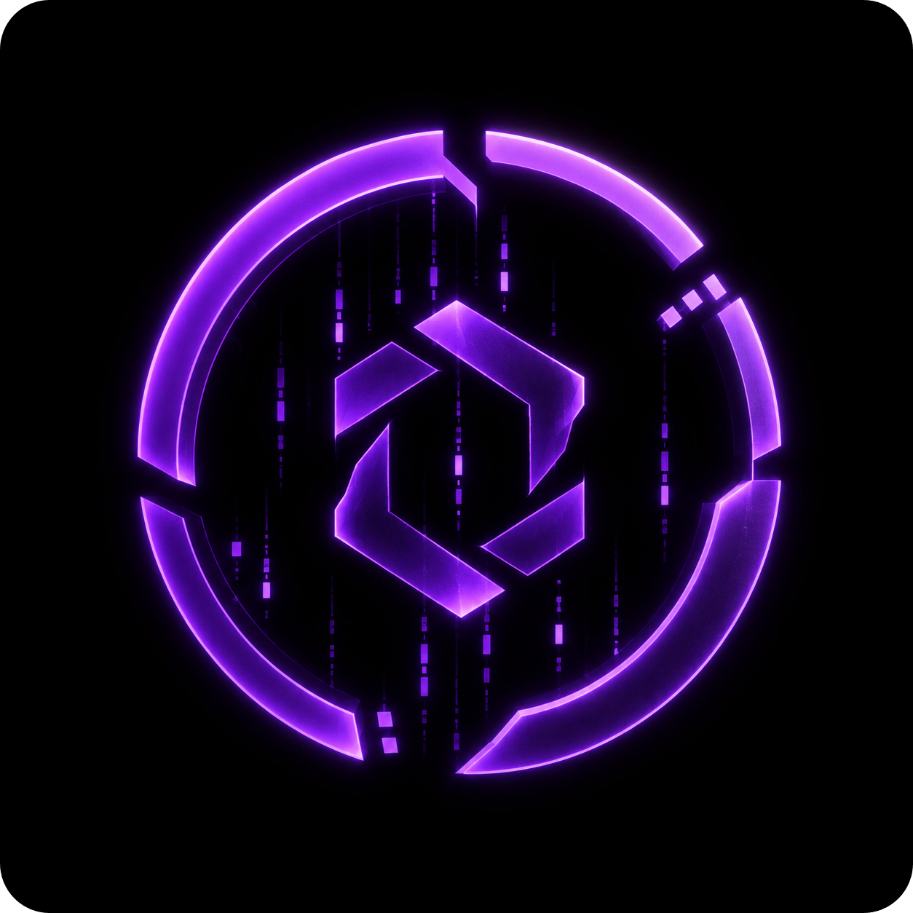
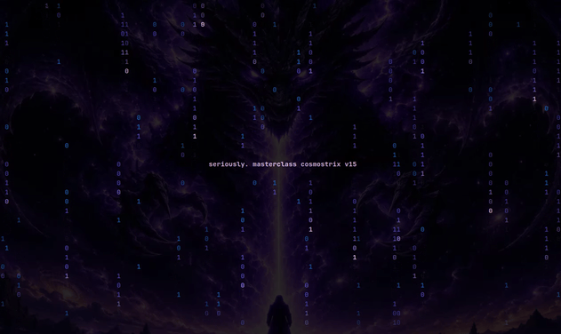
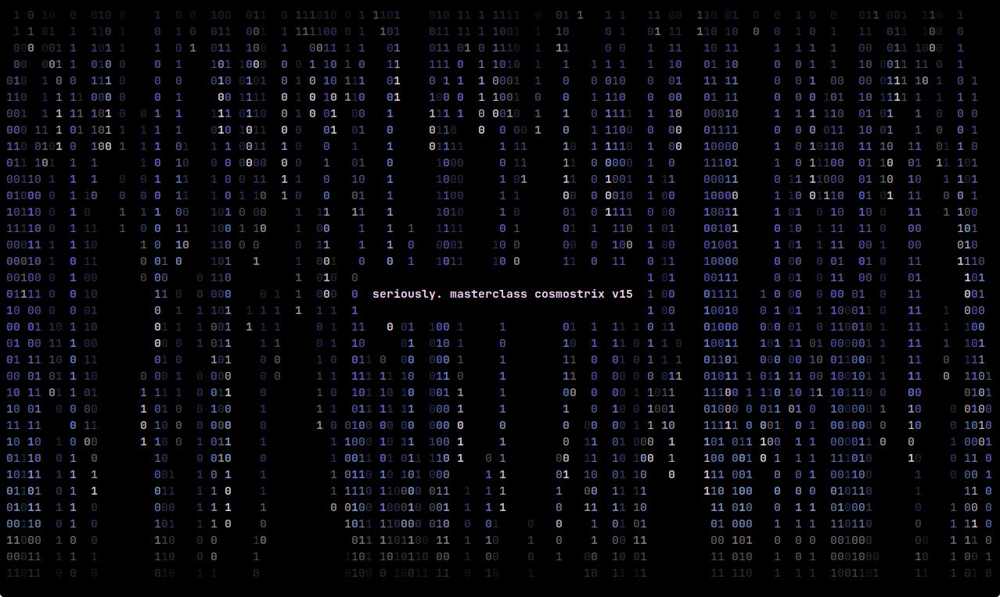
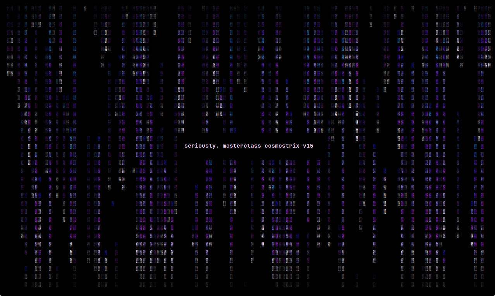
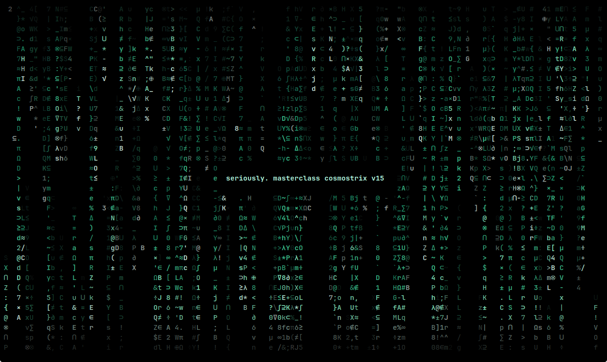
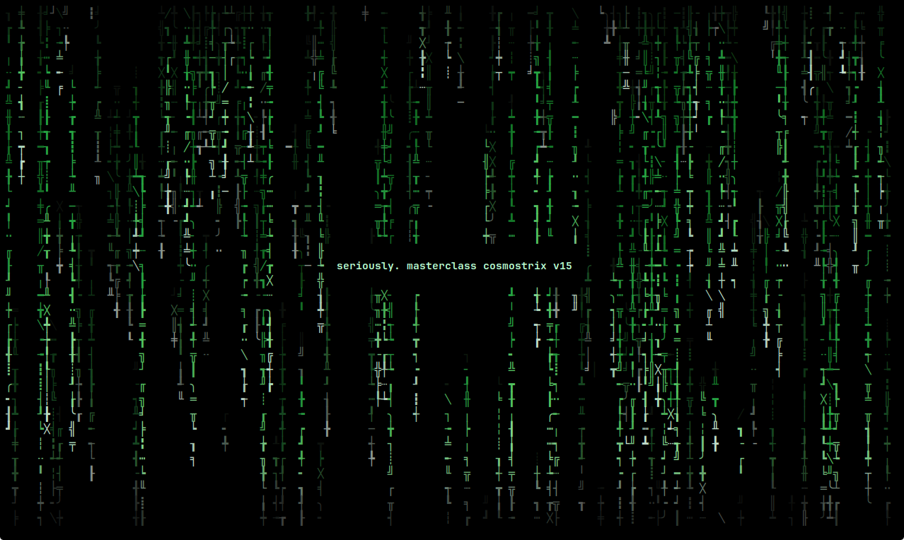

<!-- SPDX-License-Identifier: GPL-3.0-only -->

<p align="center">
  
</p>

<h1 align="center">cosmostrix</h1>

<p align="center">
  <strong>Professional-grade cinematic Matrix rain renderer for serious terminal environments.</strong>
</p>

<p align="center">
  Powered by two cooperating engines: <strong>The Cosmic Dragon Diff-Based Rendering Engine</strong> (only changed cells are redrawn, not the full screen) and <strong>The Chroma Dragon Coloring Engine</strong> (perceptually uniform OKLab gradients, palette-relative brightness floor, hue-preserving transition smoothing).
</p>

<p align="center">
  <a href="https://ko-fi.com/rezky">
    
  </a>
</p>

## Demo

<p align="center">
  
</p>

<p align="center">
  
  <br>
  
  <br>
  
  <br>
  
  <br>
  
</p>

<p align="center">
  <a href="https://www.youtube.com/watch?v=KSk-DWFdg3A">YouTube</a>
</p>

Signature Cinematic Cosmic, Monolith Rain, and message mode in a real terminal session.

## About — Two Engines, One Renderer

Cosmostrix is built on **two cooperating engines** that split the rendering work along a clean boundary: *what cells changed* vs *what color a cell becomes*.

### The Cosmic Dragon Diff-Based Rendering Engine

Lives at the crate root: `src/frame.rs`, `src/terminal/`, `src/terminal_tty.rs`, `src/runtime.rs` — imported by every render-path module. Owns the **diff-based render loop**: a persistent back-buffer of `Cell` values is compared frame-to-frame, and only changed cells are emitted as ANSI escape sequences (with RLE batching on consecutive dirty cells in the same row). On a typical 120×40 terminal that means ~360 cell-writes per frame instead of 4,800 — a 13× reduction in I/O that compounds with screen size. At 400×200 (80,000 cells) the savings exceed 90%.

This is what makes the cinematic effects affordable: phosphor decay, 3-layer parallax, density sculpting, and atmospheric modulation all stack on top of a render path that already only writes the cells that changed. Without the diff engine, those effects would be unrenderable. On a 2-vCPU cloud Xeon the engine sustains 103,021 avg_fps on the `monolith` scene at 80×24, 59,222 at 120×40, and 13,992 at 400×200 (v50 nightly.1, pro-linux-v4 build, headless dry I/O). All benchmark numbers were measured on Linux (Intel Xeon, minimum kernel or latest) — actual performance on macOS, Windows, or BSD may vary.

### The Chroma Dragon Coloring Engine

Lives under `src/chroma/` (`palette`, `catalog`, `gradient`, `shaders`, `post`, `tuning`). Owns every decision about *what color a cell becomes*. Where the Cosmic Dragon asks "did this cell change?", the Chroma Dragon answers "what color should it be now?"

The Chroma Dragon is locked at **Phase 9-D** — 9 phases of perceptual color work, culminating in invariant tests (`src/chroma/lock_tests.rs`) that assert the engine's public contract on every commit:

- **OKLab gradient interpolation** (Phase 3-A) — perceptually uniform, no muddy mid-tones on hue-crossing gradients
- **Dragon Awakening** (Phase 4) — temporal column hue coherence, subpixel hue jitter, and head halo via background blend are always-on
- **Perceptual L + chroma smoothing** (Phase 5 + Phase 8) — palette transitions sweep through a perceptual color space instead of hard-snapping
- **Palette-relative brightness floor** (Phase 7-c) — replaces the v17 global `MIN_RGB_SUM = 180` with a floor derived from each palette's own brightness profile; dark themes (Cosmos, Mercury, Moon) keep their aesthetic instead of being washed out
- **Body-tail continuity** (Phase 7-d) — enforces a 2.0× max adjacent brightness gap, killing the horizontal-line illusion at high rain speed
- **Hue-preserving polar gradient** (Phase 9-A → 9-D) — sole production OKLab path (Cartesian removed); fully saturated midpoints on opposing-hue gradients

See `cosmostrix --docs` for the full technical breakdown, or run `cargo test lock_tests -- --nocapture` to print the engine lock report.

## Architecture — Not Just Matrix Rain

Cosmostrix is **not a clone**. The Cosmic Dragon diff-based rendering engine computes only the ~7.5% of cells that change between frames, rather than redrawing the entire screen. This enables cinematic effects — phosphor decay, depth fog, 3-layer parallax, density maps — at practical terminal-bounded FPS (60–240 on Alacritty/kitty/WezTerm) while using only **~4–5 MiB of RAM** (varies by terminal size; 4.1 MiB at 80×24 on a 2-vCPU cloud Xeon) and a single CPU core. The engine's throughput ceiling on a 2-vCPU cloud Xeon is 103,021 avg_fps (`monolith` scene, v50 nightly.1, 80×24) — both well above the interactive cap, so the engine is never the bottleneck. No GPU. No bloat.

Every other Matrix rain renderer redraws every cell every frame. Cosmostrix keeps a persistent back-buffer, compares each cell against the previous frame, and emits only the ANSI sequences for cells that actually changed. On a typical 120×40 terminal that means ~360 cell-writes per frame instead of 4,800 — a 13× reduction in I/O that compounds with screen size. At 400×200 (80,000 cells), the savings exceed 90%.

The renderer is structured as five cooperating subsystems (Cosmic Dragon) plus the Chroma Dragon coloring pipeline:

1. **Diff-based cell renderer** (`src/frame.rs`, `src/terminal/`) — back-buffer comparison, RLE-batched ANSI output, dirty-region tracking. The core innovation.
2. **3-layer parallax** (`src/cloud/spawn.rs`, `src/cloud/rain.rs`; multipliers in `src/constants.rs`) — far / mid / near layers with independent speed, brightness, length, density, and phosphor-decay multipliers. Three layers is the cinema-standard deep/mid/ground composition; more would collapse perceptually in a 24-row terminal.
3. **Phosphor persistence** (`src/cloud/phosphor.rs`) — CRT afterglow with `PHOSPHOR_TAIL_RESIDUAL=160` + `PHOSPHOR_DECAY_RATE=5.0`, per-layer decay multipliers, bottom-row 2× acceleration, edge energy cap. Creates ~400 ms afterglow per glyph. Most terminal rain renderers have zero afterglow.
4. **Density noise & wind gusts** (`src/cloud/living_rain.rs`, `src/cloud/monolith.rs`) — Perlin-style density maps for cinematic monolith formations, gust-driven column acceleration for organic motion that never repeats.
5. **Ambient scheduler** (`src/ambient_scheduler.rs`) — time-of-day scene scheduling with auto-snapback (idle 30s restores the active ambient phase). Replaces the v30 atmosphere engine (eliminated) with a leaner, deterministic design.
6. **Chroma Dragon coloring engine** (`src/chroma/`) — the coloring counterpart to the Cosmic Dragon. Owns palette construction, OKLab gradient interpolation, cell-color resolution, transition L+chroma smoothing, atmospheric post-processing, and palette-aware anomaly halos. Locked at Phase 9-D (see About section above).

Run `cosmostrix --docs` for the full technical breakdown, or `cosmostrix --benchmark` for reproducible performance measurements on your own hardware.

## Philosophy — Not a Toy, But a Masterpiece

Cosmostrix is powered by **The Cosmic Dragon Diff-Based Rendering Engine** (the rendering substrate) and **The Chroma Dragon Coloring Engine** (the perceptual color pipeline) — two serious diff-based + perceptual-color masterpieces, not a hobbyist project or a toy. They stand in relation to ordinary Matrix rain renderers the way the *Mona Lisa* stands to a paint-by-numbers kit: same medium, completely different discipline.

Every design decision in Cosmostrix is governed by one question: *does this serve the cinematic aesthetic?* Features that compromise that aesthetic are rejected on principle, no matter how popular or how easy they would be to add.

- **No emoji. No wide characters. No colorful pictograms in the rain.** These are the visual language of chat apps and children's games — childish noise that would shatter the elegant, monochrome dignity of the cascade. The rain speaks in glyphs: katakana, binary, hacker charset, cosmic runes. Adding a dragon emoji or a skull pictogram to the stream would turn a masterpiece into a sticker book. This is a permanent design constraint, not a missing feature.
- **Diff-based rendering is the innovation, not a gimmick.** Most "Matrix rain" projects redraw the entire screen every frame — a brute-force approach that maxes out at a few hundred FPS on a small terminal. Cosmostrix's double-buffered generation system tracks exactly which cells changed and emits only those, with near-zero per-frame heap allocation (0.0 allocs/frame on the lean path, ~1.1 on the production-draw I/O path). On a 2-vCPU cloud Xeon the `monolith` ceiling scene sustains 103,021 avg_fps at 80×24 (v50 nightly.1, pro-linux-v4) — both far above the 60 FPS interactive cap, so the engine is never the bottleneck. This is what makes the cinematic effects (phosphor decay, 3-layer parallax, density sculpting) affordable at all — without the diff engine, they would be unrenderable.
- **Perceptual color, not RGB math.** The Chroma Dragon interpolates palettes in OKLab space (perceptually uniform) and smooths palette transitions through the polar chroma ring (hue-preserving). Most terminal rain renderers do naive sRGB lerps that produce muddy brown/gray midpoints on hue-crossing gradients and hard color seams at palette switches. Cosmostrix's color pipeline is engineered to look clean at every transition, on every theme, at every speed.
- **CPU-only by choice.** A GPU would paint an image; Cosmostrix writes a sentence. The terminal is a text medium, and its soul is ANSI escape sequences and copy-pasteable glyphs. GPU image-mode via the kitty graphics protocol was evaluated and explicitly rejected because it would change Cosmostrix from "terminal rain" to "image rain" — a different program entirely.
- **Exclusive by design.** Cosmostrix does not try to be everything to everyone. It does not chase feature parity with toy projects. It pursues depth — phosphor physics, atmospheric modulation, endurance telemetry, perceptual color — that no toy would attempt. If you want a quick Matrix screensaver, there are dozens. If you want a rendering engine that treats the terminal as a serious artistic medium, there is Cosmostrix.

The Dragon's roar is not loud — it is precise.

## Features

- **Cinematic terminal rain** — calm, organic visual feel with crisp head/body/trail hierarchy and desynchronized column speeds (async mode default ON for organic feel)
- **Cosmic Dragon diff-based rendering engine (v30 locked)** — double-buffered generation-based dirty tracking (O(1) `clear_dirty` via single u32 bump, replaces the standard O(N) `Vec<bool>` memset), `semantic_gen` invalidation counter (eliminates stale-glyph residue on charset/theme switches), `/dev/tty` fallback (recovers from broken stdout mid-run — unique among terminal renderers), single-syscall flush via `SYNC_START + ansi_buf + SYNC_END` concatenation, and pre-formatted `ColorCache` SGR bytes (near-zero `format!()` calls in the hot path; 0.0 allocs/frame on lean path, ~1.1 on production-draw I/O path). Invariant tests in `src/cosmic_dragon/lock_tests.rs` lock the engine's contract on every commit.
- **Chroma Dragon coloring engine (Phase 9-D locked)** — OKLab gradient interpolation, palette-relative brightness floor (Phase 7-c, replaces v17 global `MIN_RGB_SUM=180`), body-tail continuity (Phase 7-d, 2.0× max gap), perceptual L+chroma smoothing at palette transitions (Phase 5 + Phase 8), head halo via background blend (Phase 4-D), subpixel hue jitter (Phase 4-B), temporal column hue coherence (Phase 4-A), palette-aware anomaly halos (Phase 6), hue-preserving polar gradient — sole production OKLab path (Phase 9-A → 9-D). Invariant tests in `src/chroma/lock_tests.rs` lock the engine's contract on every commit.
- **18 built-in scenes** — one-command visual profiles: 3 core atmospheres (cinematic, matrix, monolith), 9 curated scenes (classic, signal, calm, storm, cosmos, neon, hacker, matrix_film, low-power), the `cosmic-dragon` milestone scene commemorating the temporal-prediction breakthrough (dirty_ratio 18.33% → 0.39%, FPS 7,843 → 29,773), the `carbonic` tribute scene (dense metallic carbon-fiber binary rain honoring the experiment that was reverted for cinematic quality), and 4 honor scenes: `dragon-crystal` (cosmostrix + oxyzenQ journey, hardthinking-mode reward), `orange-cat` (in memory of the owner's orange cat, 2 Aug 2026), `north-stars` (3 AM stargazing), and `curiosity` (the engine that built cosmostrix)
- **User-defined custom scenes** — `[scene-custom.<name>]` blocks in config for persistent personal themes, applied via `--scene-custom`; supports 13 configurable fields including density-map sculpting for monolith pillar formations
- **Ambient scheduler** — `ambient."HH-MM" = "scene"` config entries define time-of-day scene scheduling (e.g. `ambient."22-10" = "aurora"` runs aurora from 22:00 to 10:00); idle-based auto-snapback (30s) restores the active ambient phase after user overrides ('c'/'C'/'x'/'s'); live config reload re-parses immediately on save
- 44 built-in themes and 25 character sets (`--color-tune` turns all 44 into 44 × ∞ variants)
- **3-layer parallax depth** — far/mid/near layers with per-layer speed `[0.35, 1.0, 1.7]`, brightness `[0.52, 0.80, 1.10]`, length `[0.5, 1.0, 1.4]`, density `[0.45, 0.62, 0.85]`, and phosphor decay `[2.0, 1.2, 0.6]`. 3 layers is the cinema-standard deep/mid/ground composition; more layers collapse perceptually in a 24-row terminal
- **Phosphor persistence (CRT afterglow)** — `PHOSPHOR_TAIL_RESIDUAL=160` + `PHOSPHOR_DECAY_RATE=5.0` with per-layer decay mult, bottom-row 2× acceleration, and edge energy cap. Creates ~400ms afterglow per glyph — most terminal rain renderers have zero afterglow
- **Depth fog** — 3-row bottom vignette (`FOG_MIN_FACTOR=1.0`, disabled in v50 alpha — redundant with per-layer contrast reduction) + per-layer contrast reduction `[0.50, 0.18, 0.0]` (depth-of-field perceptual blur for far layer only)
- TrueColor gradients with luminous head glow
- Configurable speed, density, FPS, and glitch intensity
- Density map sculpting — per-column weight maps (0.0–1.0) for cinematic monolith formations (e.g. twin pillars, cascading waterfall, central throne)
- Auto color drift — cycle color scheme over time (`--auto-color-drift` / `auto-color-drift = true` in config)
- Message overlay — display custom text on the rain (`--message "wake up, neo"`)
- Alternate screen with diff-based rendering — no scrollback spam, RLE batched output
- Live HUD — real-time FPS, p99, max frame-time, RSS, endurance health score,
  effective pressure, speed/density/scene/charset/color confirmation, uptime,
  terminal size, and build commit overlay (toggle with `i`)
- **Phase-aware endurance subsystem** — EMA-based activity prediction (PAP), idle coalescing (IPAC), memory reclaim hints (MPAR via `madvise` on Linux), and Endurance Health Score (EHS, 0–100) for long-running sessions. RSS and context-switch sampling are Linux-only; other platforms get frame-jitter-only EHS
- Adaptive throttling — reduces CPU usage when idle (30s no-input → 0.5× FPS factor)
- Live config reload via filesystem watch (optional, `notify` crate) — full Cloud rebuild with strict validation on save
- Screensaver mode — only `q` exits; all runtime keys (`c`/`C`, `s`/`S`, `p`, `x`, `[`/`]`, `Up`/`Down`, `Space`, `i`) still work for interactive control. Unrecognized keys (`a`, `m`, `g`, `b`/`B`, `Tab`, `Ctrl+Z`, function keys, etc.) are silently ignored — no accidental exit
- Always-on mouse glow + click wave effects (cursor halo + dual-ring chromatic shockwave + quantum ripple with color cycling + comet trail). All effects route through the chroma dragon pipeline. Note: always-on mouse reporting blocks text selection in all modes
- Cinematic intro — `--intro cosmic|logo|none` (default: logo). The logo intro fades in character-by-character, a spark falls and ignites the logo on impact, then the logo dissolves into Matrix rain. The cosmic intro bursts a singularity into spiraling particles. Plays in all modes including `--screensaver`. Skipped only on terminals smaller than 80×24
- Fixed virtual screen size (`--screen-size WxH`) for benchmarking at exact dimensions or rendering independent of terminal resize
- 5-layer destructive terminal recovery (`--reset-terminal`)
- Ambient scheduler with auto-snapback (replaces the v30 atmosphere engine)
- Benchmark mode with JSON output, compound duration format (`--bench-duration 1h30m`), self-documenting reports (CPU model, rustc, LTO/PGO, git SHA)
- Terminal diagnostics (`--doctor`) and config validation (`--testconf`)
- PGO (Profile-Guided Optimization) nitro build via `./scripts/build.sh pgo` (3-stage: instrument → benchmark → optimize)
- Cross-platform: Linux, macOS, Windows, Android (Termux), FreeBSD

## Limitations

Cosmostrix is a CPU-only terminal renderer with deliberate scope. The list below is honest about what it does not do — most of these are design choices, not missing features.

- **CPU-only, no GPU.** Rain is rendered as ANSI text over a PTY; no GPU context is ever created (the benchmark reports `gpu_usage: not_applicable`). GPU bitmap rendering was evaluated and rejected because it changes the character-grid aesthetic. See [docs/archive/cosmic_dragon/EXPLORATION.md](docs/archive/cosmic_dragon/EXPLORATION.md).
- **Interactive FPS is terminal-bounded.** The engine's throughput ceiling on a 2-vCPU cloud Xeon is 103,021 avg_fps on `monolith` at 80×24 (v50 nightly.1, pro-linux-v4, headless). Real on-screen FPS is bounded by your terminal emulator's ANSI parse speed (typically 60–240 FPS on Alacritty/kitty, less on slower terminals). The engine is never the bottleneck — the terminal is. This is a fundamental limit of terminal rendering.
- **`kill -9` cannot be caught.** No process can intercept SIGKILL. On Linux, a fork-based guard restores `termios` best-effort; on macOS and Windows, run `cosmostrix --reset-terminal` for 5-layer recovery.
- **SIGTSTP (Ctrl-Z) suspends in raw mode.** The terminal stays in raw mode while cosmostrix is backgrounded. Recovery is automatic on `fg`/SIGCONT as long as nothing else wrote to the TTY.
- **Windows Terminal cleanup is best-effort** ([#15](https://github.com/oxyzenQ/cosmostrix/issues/15)). Forced termination (task kill, close window, signout) on Windows Terminal / ConHost may leave the terminal in a degraded state (scrolled buffer visible, cursor hidden). Beyond what crossterm provides, cosmostrix does not claim specific guarantees for Windows forced-termination paths. Run `cosmostrix --reset-terminal` to recover.
- **RSS and CPU metrics are Linux/macOS only.** `--benchmark` emits `unsupported` on Windows rather than fake values.
- **No prebuilt binary for Windows ARM64 or Intel Mac.** Prebuilt releases cover `windows-x86_64` and `darwin-aarch64-native` only. Windows ARM64 (`aarch64-pc-windows-msvc`) and Intel Mac (`x86_64-apple-darwin`) users must build from source.
- **No audio.** Cosmostrix is a visual screensaver.
- **Screen size limits (v18).** `--screen-size WxH` clamps to a per-mode ceiling:
  - **Interactive mode**: `4×4` minimum, `1024×500` maximum (`MAX_TERMINAL_COLS/LINES`). Larger sizes would allocate >24 MiB of cell grid and degrade interactive FPS.
  - **Benchmark mode**: `4×4` minimum, `7680×4320` (8K UHD) maximum (`BENCH_MAX_COLS/LINES`). 8K is the largest meaningful stress resolution — anything larger (e.g. 50000×50000) measures the OOM killer, not the renderer. 4K UHD (3840×2160) is the recommended daily-driver for stress tests; 8K is the ceiling.
  - `--bench-all` runs a fixed ladder of sizes (`6×6` → `20×20` → `40×20` → `80×24` → `120×40` → `200×60`) and is unaffected by the bench ceiling.

  See [KNOWN_ISSUES.md](KNOWN_ISSUES.md) for platform-specific quirks and mitigations.

## Requirements

- Rust 1.97.1+ (MSRV, pinned via `rust-toolchain.toml`) to build from source
- Linux kernel 2.6.27+ / macOS 10.12+ / Windows 10 1809+
- A terminal supporting ANSI escape sequences, alternate screen, and raw mode
- Best results with 256-color or truecolor terminals

For the full compatibility matrix (kernel versions, glibc/musl, CPU architectures, terminal capabilities), see [System Requirements](docs/SYSTEM_REQUIREMENTS.md).

### Recommended Fonts

Cosmostrix renders glyphs the terminal emulator draws — your font choice shapes the cinematic experience. For the masterclass look, use a monospace font with distinct `0`/`1` glyphs, full Unicode coverage (for box-drawing borders `╭╮╰╯─│`, braille `⠿`, katakana `ｱ`, and runic `ᚠ`), and balanced width.

| Font | Why | Best for |
|---|---|---|
| **JetBrains Mono** | Distinct `0`/`1`, full Unicode, open source, popular | Default — best balance |
| **Iosevka** | Configurable width, very compact, Nerd Font compatible | Small terminals / high density |
| **Monaspace Krypton** | Variable axis, high contrast, modern | Cinematic aesthetic |

Avoid `Fira Code` (ligatures disrupt `0`/`1` rain) and system defaults (Consolas, Menlo) which lack full Unicode coverage for box-drawing + braille charsets.

The chroma dragon border gradient (`--message` overlay) and HUD chroma gradient (16-stop sweep) look best on a font with crisp, high-contrast glyph edges.

## Installation

### GitHub Releases (prebuilt binaries)

Download from [Releases](https://github.com/oxyzenQ/cosmostrix/releases), verify the checksum, and place `cosmostrix` in your `PATH`.

Each release ships **three** checksums: classical SHA-512 + quantum-resistant
BLAKE2b-512 + SHAKE256. Full instructions in
[docs/VERIFY_RELEASE.md](docs/VERIFY_RELEASE.md).

```bash
# Classical (universal)
sha512sum -c cosmostrix-bin-vX.Y.Z-linux-amd64-musl.tar.gz.sha512sum

# Quantum-resistant — BLAKE2b (fastest, in coreutils)
b2sum -c cosmostrix-bin-vX.Y.Z-linux-amd64-musl.tar.gz.b2sum

# Quantum-resistant — SHAKE256 (NIST PQ standard, via Python)
# openssl's -shake256 default output length varies; Python is consistent
COMPUTED=$(python3 -c "import hashlib; print(hashlib.shake_256(open('cosmostrix-bin-vX.Y.Z-linux-amd64-musl.tar.gz','rb').read()).hexdigest(64))")
EXPECTED=$(awk '{print $1}' cosmostrix-bin-vX.Y.Z-linux-amd64-musl.tar.gz.shake256)
[ "$COMPUTED" = "$EXPECTED" ] && echo "OK" || echo "FAILED"
```

### GPG signature verification (official builds)

Official release artifacts are GPG-signed with the maintainer's key, producing a `.tar.gz.asc` (or `.zip.asc`) detached signature alongside every archive. This lets you confirm the binary was produced from the official source tree by **Rezky Cahya Sahputra (cosmic dragon)** and not tampered with in transit. Third-party rebuilds will not carry a valid signature.

```bash
# 1. Import the maintainer's public key from a keyserver
gpg --keyserver keyserver.ubuntu.com --recv-keys 47A50AEF4B65AAC2

# 2. Verify the detached signature against the downloaded archive
gpg --verify cosmostrix-bin-vX.Y.Z-linux-amd64-v3.tar.gz.asc \
            cosmostrix-bin-vX.Y.Z-linux-amd64-v3.tar.gz
```

A `Good signature from "Rezky Cahya Sahputra (cosmic dragon)"` line confirms authenticity. The full public key fingerprint (`F532 4E09 67F1 04D5 8CE0 25F3 47A5 0AEF 4B65 AAC2`) and detailed verification instructions live in [docs/VERIFY_RELEASE.md](docs/VERIFY_RELEASE.md). Binaries produced locally via `cargo build` or `./scripts/build.sh release` carry the embedded `Cosmic Dragon — Official Build by rezky_nightky (oxyzenQ)` signature string, discoverable via `strings ./cosmostrix | grep "Cosmic Dragon"`.

**Available platforms:**

- Linux amd64: `v3`, `v4`, `musl` (also `linux-aarch64` for arm64)
- macOS: `darwin-aarch64-native` (Apple Silicon; no Intel Mac prebuilt — build from source for `x86_64-apple-darwin`)
- FreeBSD: `freebsd-amd64` (requires libexecinfo on 15+, see [System Requirements](docs/SYSTEM_REQUIREMENTS.md))
- Windows: `windows-x86_64` (no ARM64 prebuilt binary; build from source for `aarch64-pc-windows-msvc`)
- Android (Termux): `android-aarch64-native`

```bash
REPO="oxyzenQ/cosmostrix"
TAG="v50.0.0-beta.1"
PLATFORM="linux-amd64-v3"
curl -LO "https://github.com/${REPO}/releases/download/${TAG}/cosmostrix-bin-${TAG}-${PLATFORM}.tar.gz"
curl -LO "https://github.com/${REPO}/releases/download/${TAG}/cosmostrix-bin-${TAG}-${PLATFORM}.tar.gz.sha512sum"
sha512sum -c "cosmostrix-bin-${TAG}-${PLATFORM}.tar.gz.sha512sum"
tar -xzf "cosmostrix-bin-${TAG}-${PLATFORM}.tar.gz"
./cosmostrix --doctor
```

### AUR (Arch Linux)

```bash
paru -S cosmostrix-bin    # or: yay -S cosmostrix-bin
```

### Android (Termux)

Cosmostrix runs on Android via [Termux](https://termux.dev). Install the Termux app, then:

1. Download the `cosmostrix-*-android-aarch64-native.tar.gz` archive from the [latest release](https://github.com/oxyzenQ/cosmostrix/releases/latest).
2. Allow storage access (for `/sdcard/cosmostrix/` config path) and extract:

```bash
# Allow storage access (for /sdcard/cosmostrix/ config path)
termux-setup-storage

# Extract the archive you downloaded from the releases page
tar -xzf cosmostrix-*-android-aarch64-native.tar.gz

# Config (Termux uses standard Linux paths)
cosmostrix --dump-config ~/.config/cosmostrix/config.toml

# Run
./cosmostrix
```

Config paths on Android/Termux:
- **Default**: `~/.config/cosmostrix/config.toml` (Termux HOME)
- **External storage**: `/sdcard/cosmostrix/config.toml` (accessible from other apps)

### From source

```bash
git clone https://github.com/oxyzenQ/cosmostrix.git
cd cosmostrix
cargo install --path .
cosmostrix --doctor
```

### Optimized local builds

For a modern Linux x86_64 machine, the recommended optimized build is:

```bash
cargo pro-linux-v3
```

On FreeBSD (after installing libexecinfo — see [System Requirements](docs/SYSTEM_REQUIREMENTS.md#freebsd)):

```bash
cargo pro-freebsd-amd64
```

Artifact variants use explicit CPU baselines:

| Variant | Baseline |
|---|---|
| `linux-amd64-v3` | AVX2 / BMI2 / FMA-era CPUs (2013+, most modern x86_64) |
| `linux-amd64-v4` | AVX-512 baseline (high-end server/workstation) |
| `linux-amd64-musl` | v3 baseline + statically linked (max portability) |
| `freebsd-amd64` | native (host CPU) — FreeBSD 13+, GhostBSD |
| `native` | Local-only build tuned for the current CPU |

> **Note:** v1/v2 x86_64 variants were dropped in an earlier release. Modern CPUs
> (2013+) support v3. For maximum portability (Alpine, containers,
> minimal base images), use the `musl` variant — it's statically linked
> with no glibc dependency.

Release/pro builds keep `panic = "unwind"` on purpose. Cosmostrix owns raw mode,
alternate screen, cursor visibility, and line-wrap state while running; unwinding
lets the RAII terminal guard and panic hook restore the terminal on panic.

To verify an optimized artifact:

```bash
target/x86_64-unknown-linux-gnu/pro-linux-v3/cosmostrix --doctor
file target/x86_64-unknown-linux-gnu/pro-linux-v3/cosmostrix
scripts/verify-release-build.sh pro-linux-v3
```

## Quickstart

```bash
cosmostrix                           # signature Cinematic Cosmic default
cosmostrix --color dragon-crystal --speed 12   # color + speed
cosmostrix --screensaver              # only q exits (all other keys ignored)
cosmostrix --message "wake up, neo"   # overlay message
cosmostrix --charset katakana         # character set
cosmostrix --scene cinematic          # built-in scene
cosmostrix --scene monolith --color cosmos
cosmostrix --config ~/.config/cosmostrix/config.toml  # explicit config (whitelist-enforced)
cosmostrix --scene-custom hacker-mode   # user-defined custom scene
cosmostrix --intro cosmic             # cosmic burst intro before rain
```

## CLI Reference

Run `cosmostrix --help` for the full reference manual (CLI flags, runtime controls, atmosphere phases, rendering philosophy). The CLI flags below are grouped exactly as `--help` groups them.

```text
COMMON OPTIONS
  -c, --color <name>          Color theme (see --list-colors). 44 built-in themes.
      --colors-custom <name>  Load a user-defined custom color palette from config (v16)
      --color-tune <k=v>      Tune theme colors (keys: sat=, bright=, head=, body=, tail=; range 0.0-3.0)
  -C, --charset <name>        Character set (see --list-charsets; custom via [charset-custom]).
                              Alias: --charset-custom <name> (same flag, parity with --colors-custom)
  -f, --fps <1-240>           Target FPS
  -S, --speed <1-100>         Rain speed
  -d, --density <0.01-5.0>    Rain density
  -s, --screensaver           Only q exits (all other keys ignored). Mouse events captured to block selection
  -m, --message <text>        Overlay message (no border). Use -mb for border
      --glitch-level <level>  Glitch intensity (none|subtle|default|intense)
      --scene <name>          Apply a built-in scene atmosphere (see --list-scenes)
      --scene-custom <name>   Apply a user-defined custom scene from config
      --intro [cosmic|logo|none]
                              Cinematic intro before rain begins (default: logo).
                              Plays in all modes including --screensaver. Skipped
                              only on terminals < 80x24. Press q to skip mid-animation.
                              Set permanently via `intro = "..."` in config.

ADVANCED
      --monolith-size <size>  Monolith segment cell scale (small|normal|large)
      --uniform               Uniform column speeds (disables async variable pacing)
  Mouse interaction           Always on, no flag. Cursor glow + dual-ring click wave.
                              Mouse reporting always active (blocks text selection).

CONFIG
      --config <path>         Load config from an explicit file (strict whitelist + .toml)
      --dump-config [path]    Print example config to stdout, or write to file (whitelist + .toml)
      --force                 Force overwrite when writing files. Currently scoped to
                              --dump-config ONLY: allows overwriting an existing config
                              at the target path. Other write operations unaffected.
      --config-path           Print the resolved default config path
      --testconf              Validate config.toml and report errors (exit 0 = pass, 2 = fail)

DIAGNOSTICS
      --doctor                Compatibility report
      --docs                  Print engine documentation and architecture overview
                              (covers both Cosmic Dragon + Chroma Dragon engines)
      --benchmark             Renderer benchmark (5s default; override with --bench-duration)
      --bench-duration <dur>  Benchmark duration (e.g. 5, 6s, 30m, 1h30m; min 1s)
      --json                  Output benchmark as JSON (use with --benchmark; for CI/scripts)
      --screen-size <WxH>     Fixed screen size (e.g. 120x40; min 4x4, max 1024x500 interactive / 7680x4320 bench)
      --bench-io              Benchmark with wet terminal I/O (writes ANSI to /dev/null)
      --bench-all             Run benchmark across multiple screen sizes (6x6 to 200x60)
      --bench-scene <name>    Benchmark I/O scene: 'lean' (default, emit_cell_lean) or
                              'production-draw' (mirrors Terminal::draw full-redraw path).
                              Use 'production-draw' to measure the BOLT-backed production
                              render path; pair with --bench-io to write ANSI to /dev/null.
                              Strict: typos are rejected at parse time, never silently
                              fallback'd to the default lean path.
      --save-baseline <path>  Save benchmark JSON for later comparison
      --compare-baseline <p>  Compare against saved baseline (flags >5% FPS regressions)
      --reset-terminal        Emergency terminal recovery (5-layer: ANSI + crossterm + stty + reset)
  -v, --verbose               Print diagnostic info to stderr (with [HH:MM] timestamps)

DISCOVERY
      --list-colors           Show compact color theme names (44 built-in themes)
      --list-charsets         Show available character sets (25 built-in sets)
      --list-scenes           Show built-in and custom scenes
      --show-scene <name>     Show full details for a scene

HELP
      --help                  Print the full reference manual
  -V, --version               Print complete version and build information
      --check-update          Check the latest upstream release
```

Explicit CLI flags always override scene and scene-custom values.

## Runtime Controls

Only `q` quits. All other unrecognized keys are silently ignored (no glitch, no accidental exit). Mouse click does NOT exit (v17: removed for consistency with the "only q quits" policy). Mouse events are still captured to block text selection.

```text
  q             Quit              p          Pause / resume
  c / C         Cycle theme       s / S      Cycle charset
  x             Cycle scene       [ / ]      Density
  Up / Down     Speed             Space      Reseed animation
  i             Toggle live HUD (FPS / max / p99 / CPU% / RSS / EHS / PRS / speed /
                density / scene / charset / color / uptime / screensize / cid)
```

## Scenes

**Core atmospheres** (interactive cycle with `x`):
- `cinematic` — default signature Cosmic Binary with slow vast pacing and deep-space breathing room
- `matrix` — classic Matrix glyph rain
- `monolith` — structured Cosmostrix Monolith Rain with sparse structured segments

**Curated scenes** (via `--scene <name>`):
- `signal`, `classic`, `calm`, `storm`, `cosmos`, `neon`, `hacker`, `matrix_film`, `low-power`

**Film homage scene**:
- `matrix_film` — dense phosphor-green katakana rain tuned to the Matrix 1999 cinematic source (palette `neon-green` + charset `matrix` + speed 22 + density 0.85). Not a 1:1 reproduction: cosmostrix's parallax depth, phosphor decay, and head-bloom layer onto the film's foundational look. Distinct from the `matrix` scene (the modern organic cascade, density 0.65, speed 18.0). Use `cosmostrix --scene matrix_film`.

**Milestone scene**:
- `cosmic-dragon` — deep-space binary rain commemorating the temporal-prediction breakthrough (horizon=12 + skip-draw + persistent cells: dirty_ratio 18.33% → 0.39%, FPS +280%). Use `cosmostrix --scene cosmic-dragon`.

**Honor scenes**:
- `dragon-crystal` — living crystal violet rain; honors the cosmostrix + oxyzenQ journey and the hardthinking-mode reward. Uses the `energy-zen` premium palette. `cosmostrix --scene dragon-crystal`.
- `orange-cat` — warm amber-gold gentle rain; in memory of the owner's orange cat (2 Aug 2026). `cosmostrix --scene orange-cat`.
- `north-stars` — sparse white-gold pinprick starlight; honors 3 AM stargazing. `cosmostrix --scene north-stars`.
- `curiosity` — vibrant spectrum rainbow rain; honors the owner's wonder, the engine that built cosmostrix. `cosmostrix --scene curiosity`.

**Tribute scene**:
- `carbonic` — dense metallic carbon-fiber binary rain (palette `carbon` + charset `binary` + speed 18 + density 0.95). A tribute to the temporal-prediction experiment that was ultimately reverted for cinematic visual quality, but whose lessons about prediction, drift tolerance, and the tension between performance and beauty remain invaluable. Use `cosmostrix --scene carbonic`.

Press `x` while running to cycle core atmospheres (cinematic ↔ matrix ↔ monolith).

## Configuration

Persistent defaults can be set in `~/.config/cosmostrix/config.toml` (or `$XDG_CONFIG_HOME/cosmostrix/config.toml`). On Android Termux, `$HOME/.config/cosmostrix/config.toml` is the canonical location (XDG_CONFIG_HOME is deliberately ignored because it may point to a system location users don't edit). Use `--config <path>` to load a specific file. For security, `--config` and `--dump-config <path>` enforce a **strict whitelist** — only these directories are allowed:

- `~/.config/cosmostrix/` (Linux, macOS, FreeBSD, Android Termux — user config)
- `~/Library/Application Support/cosmostrix/` (macOS native — user config)
- `/etc/cosmostrix/` (Linux, macOS — system-wide)
- `/usr/local/etc/cosmostrix/` (FreeBSD — system-wide; FreeBSD uses `/usr/local/etc` for ports/packages, not `/etc`)
- `$PREFIX/etc/cosmostrix/` (Android Termux — system-wide, typically `/data/data/com.termux/files/usr/etc/cosmostrix/`)
- `%APPDATA%\cosmostrix\` (Windows — user config)
- `%ProgramData%\cosmostrix\` (Windows — system-wide)
- `/sdcard/cosmostrix/` (Android Termux — external storage, accessible from other apps)

Everything else is rejected: current directory (`.`), `/tmp/`, home root (`~`), `~/.local/`, `/usr/`, `/opt/`, `/var/`, all relative paths, and all other absolute paths. `--config` and `--dump-config <path>` files must also have a `.toml` extension.

To generate a starter config, use `--dump-config` with an explicit path:

```bash
cosmostrix --dump-config ~/.config/cosmostrix/config.toml
```

Shell redirection (`cosmostrix --dump-config > file`) is **blocked** — cosmostrix detects stdout-redirected-to-file and refuses to write, because the shell bypasses the whitelist. Use the explicit path form above for file output. Piping to another command (`cosmostrix --dump-config | less`) is allowed for viewing.

```
scene = "monolith"
color = "cosmos"
charset = "binary"
fps = 60
speed = 20
density = 0.75
glitch-level = "subtle"
intro = "logo"
```

Precedence: defaults → config file → scene/scene-custom layers → explicit CLI flags.

### Custom Character Sets

Custom charsets live in `config.toml` under `[charset-custom.<name>]` and replace the legacy `--charset-file <path>` CLI flag (removed in v25). Define a named glyph pool once, then activate it from the CLI or config:

```toml
[charset-custom.zen]
set = "|"
```

```bash
cosmostrix --charset zen              # CLI activation
# or in config.toml: charset = "zen"
```

Custom names take precedence over built-in presets with the same name. Validation: max 256 characters per `set`, control characters are rejected, wide/zero-width characters (emoji, CJK fullwidth) are auto-filtered with a warning. Editing a `[charset-custom]` block while cosmostrix is running takes effect on the next live reload — no restart needed.

```bash
cosmostrix --dump-config        # print example config
cosmostrix --list-scenes        # list built-in and custom scenes
cosmostrix --list-charsets      # list built-in and custom charsets
cosmostrix --config-path        # print default config path
```

## Terminal Recovery

Quit with `q` when possible. If a terminal is left in raw mode or alternate screen:

```bash
cosmostrix --reset-terminal
```

On Windows PowerShell: `.\cosmostrix.exe --reset-terminal`

For terminal behavior, background modes, tmux/SSH notes, and Windows recovery expectations, see [Terminal Compatibility](docs/TERMINAL_COMPATIBILITY.md).

## Benchmarking

Benchmark results are machine-dependent. Use them to compare builds on the same machine, not as portable performance promises. Optimized builds remain comfortably above the 60 FPS target.

```bash
cargo pro-linux-v3
COSMOSTRIX_BENCH_COLS=120 COSMOSTRIX_BENCH_LINES=40 \
  target/x86_64-unknown-linux-gnu/pro-linux-v3/cosmostrix --benchmark
```

The `--benchmark` report includes FPS, frame-time percentiles
(avg → p95 → p99 → p99.9 → max), MEMORY (RSS), CPU usage %, sub-component
timing (sim/render/io), and a DRIFT section for long-run analysis. The
SYSTEM section records the CPU model, rustc version, LTO/PGO status, and
git SHA so reports are self-documenting for cross-machine comparison. A
RESOURCE section reports page faults + context switches via `getrusage`.
A BENCHMARK ENVIRONMENT section records kernel, libc, terminal, CPU
governor, and SMT status for reproducibility. The RENDERER section
explicitly declares `gpu_usage: not_applicable` — cosmostrix is a CPU +
stdout renderer, no GPU context is ever created.

**Benchmark mode measures the engine without writing to the terminal.**
FPS numbers are synthetic uncapped throughput — how many frames the
renderer can *compute* per second, not how many frames the terminal
*draws*. Real interactive FPS is bounded by the terminal emulator,
refresh rate, and ANSI output bandwidth. Use `i` (live HUD) during a
real run to see actual interactive FPS.

Use `--bench-duration N` (min 1s, no maximum) for sustained drift / leak detection:

```bash
target/x86_64-unknown-linux-gnu/pro-linux-v3/cosmostrix --benchmark --bench-duration 60
```

Use `--json` for machine-readable output (CI/scripts):

```bash
target/x86_64-unknown-linux-gnu/pro-linux-v3/cosmostrix --benchmark --json | jq .performance.avg_fps
```

### Wet I/O benchmarking (`--bench-io` + `--bench-scene`)

By default `--benchmark` runs **dry** — it computes frames but does not write ANSI to any file descriptor. This measures pure engine throughput. To measure real terminal write bandwidth and latency, add `--bench-io` (writes ANSI to `/dev/null` so the kernel syscall path is exercised without terminal emulator overhead):

```bash
target/x86_64-unknown-linux-gnu/pro-linux-v3/cosmostrix --benchmark --bench-io --bench-duration 30
```

`--bench-scene <name>` selects which I/O scene the wet benchmark exercises:

| Scene | What it measures |
|-------|------------------|
| `lean` (default) | The `emit_cell_lean` path — per-dirty-cell SGR emission. The fastest path cosmostrix uses in interactive mode. |
| `production-draw` | The full `Terminal::draw` redraw path — `MoveTo` per row + `ColorCache` SGR + BOLT bold escape. Mirrors what the terminal actually receives during interactive rendering. Use this when you want to benchmark the production render path the user sees. |

```bash
# Measure the BOLT-backed production render path with wet I/O
target/x86_64-unknown-linux-gnu/pro-linux-v3/cosmostrix \
    --benchmark --bench-io --bench-scene production-draw --bench-duration 30
```

Pair `--bench-scene production-draw` with `--save-baseline` to lock in a regression baseline for the production path; pair with `--bench-all` to see how the production path scales across screen sizes.

> **Strict validation:** only `lean` and `production-draw` are accepted. Typos (e.g. `leanax`, `production-drawmadadadaxa`) are rejected with a clean error at parse time — cosmostrix never silently falls back to the default lean path. This is part of the honesty contract: no hidden flags, no hidden behavior.

See [docs/BENCHMARKING.md](docs/BENCHMARKING.md) for the full benchmarking guide — how to run, interpret, and compare results, plus the strict `--bench-scene` validation contract and the v50 4-scene reference matrix (103,021 avg_fps on `monolith` at 80×24, v50 nightly.1, pro-linux-v4 build). See [benchmark/README.md](benchmark/README.md) for full reference results across versions, [docs/BENCHMARK_ADVANCED.md](docs/BENCHMARK_ADVANCED.md) for MICROARCHITECTURE/ENERGY enablement, and [docs/RAIN_DEPTH_AUDIT.md](docs/RAIN_DEPTH_AUDIT.md) for the visual-audit methodology that uses `--bench-scene production-draw`.

## Documentation

- [**Docs Index**](docs/README.md) — **start here** — master index of all docs, source module map, "coming back after a break" guide
- [Changelog](CHANGELOG.md) — release history
- [Known Issues](KNOWN_ISSUES.md) — platform-specific quirks, workarounds, and planned fixes
- [System Requirements](docs/SYSTEM_REQUIREMENTS.md) — kernel, glibc/musl, CPU, terminal compatibility matrix
- [Terminal Compatibility](docs/TERMINAL_COMPATIBILITY.md) — terminal behavior, tmux/SSH, recovery
- [Endurance](docs/ENDURANCE.md) — endurance testing and resource monitoring
- [Ambient Scheduler](docs/AMBIENT_SCHEDULER.md) — time-of-day scene scheduling, auto-snapback, ambient_palette_locked harmony, and throughput stability
- [Render Engine](docs/RENDER_ENGINE.md) — diff-based rendering architecture (formal spec)
- [Cosmic Dragon Architecture](docs/COSMIC_DRAGON_ARCHITECTURE.md) — full architecture deep-dive
- [Cosmic Dragon Exploration](docs/archive/cosmic_dragon/EXPLORATION.md) — design explorations and rejected alternatives (archived; conclusions folded into PHILOSOPHY.md)
- [Supply Chain](docs/SUPPLY_CHAIN.md) — supply-chain hardening policy
- [Stability Audit](docs/STABILITY_AUDIT.md) — terminal stability audit
- [SIMD Feasibility](docs/SIMD_FEASIBILITY.md) — SIMD optimization feasibility
- [Advanced Benchmarking](docs/BENCHMARK_ADVANCED.md) — enable MICROARCHITECTURE and ENERGY metrics, interpret key benchmark fields
- [Benchmarking Guide](docs/BENCHMARKING.md) — full independent benchmarking guide: how to run, interpret, compare, strict `--bench-scene` validation, v50 4-scene reference matrix (103,021 avg_fps monolith at 80×24, v50 nightly.1, pro-linux-v4 build)
- [CI & Release Workflow](docs/workflow/about-ci.md) — CI pipeline and release process
- [Maintenance Guide](docs/MAINTENANCE.md) — build/test/update procedures, security response, health-check log (for dormant mode)
- [Contributing Guide](CONTRIBUTING.md) — build, test, coding conventions, PR checklist
- [Comprehensive Audit](docs/audits/COSMIC_DRAGON_AUDIT.md) — visual quality, stability, power management, depth assessment

## Development

```bash
cargo fmt --all
cargo clippy --locked --all-targets --all-features -- -D warnings
cargo test --all --locked
cargo test lock_tests -- --nocapture            # print the Chroma Dragon engine lock report
cargo test cosmic_dragon::lock_tests -- --nocapture  # print the Cosmic Dragon engine lock report
scripts/verify-release-build.sh pro-linux-v3 pro-linux-v4 pro-linux-musl
```

## Release Process

Create a release by pushing a `v*` tag. See [docs/workflow/about-ci.md](docs/workflow/about-ci.md) for CI and release workflow details.

### Version bump + build

Bump the version across every active file (Cargo.toml, Cargo.lock, AUR PKGBUILD, .SRCINFO, README install tag, docs/workflow/about-ci.md), then build:

```bash
./scripts/version-to.sh vX.Y.Z             # bump to vX.Y.Z across all active files
./scripts/build.sh release              # optimized release build
./scripts/build.sh version-sync         # verify all version refs agree (no build)
```

`Cargo.toml` `[package] version` is the single source of truth. Every other active version reference is derived from it — either at compile time via `env!("CARGO_PKG_VERSION")` in source, or by `./scripts/version-to.sh` for files that need a literal version string (PKGBUILD, README install example). CI runs `version-sync` as a fail-fast guard before any Rust builds, so a desync breaks the pipeline in seconds rather than after a full test job. The `scripts/check-version-anti-patterns.sh` guard blocks re-introduction of hardcoded version assertions in `src/`.

## Contributing

PRs and issues are welcome. Please run `cargo fmt` and `cargo clippy` before submitting. See [CONTRIBUTING.md](CONTRIBUTING.md) for the full guide (build, test, conventions, PR checklist) and [RULES.md](docs/RULES.md) for project conventions.

## API Stability

From **v50.0.0** onward, the following are **frozen** — no breaking changes without a major version bump:

- CLI flags (names, short/long forms, value types)
- Config format (`config.toml` keys, value types, TOML structure)
- Built-in scene names (18), color scheme names (44), charset preset names (25)
- Runtime controls (keyboard shortcuts)
- Output schemas (`--json` benchmark output, `--doctor` report format)

Breaking changes require a major version bump (e.g. v51.0.0). Minor versions (v50.1.0) may add features but must not change or remove existing API surface. See [docs/MAINTENANCE.md](docs/MAINTENANCE.md) §6 for the full stability contract.

## Support

cosmostrix is an open-source project built and maintained independently by [rezky_nightky (oxyzenQ)](https://github.com/oxyzenQ).

If this project helped you, or saved development time, you can support future maintenance here:

[](https://ko-fi.com/rezky)

Support is optional. The project remains open-source.

## Intellectual Property & Trademark

**cosmostrix** is the exclusive intellectual property of **rezky_nightky (oxyzenQ)**. Source code is licensed under **GPL-3.0-only** (see [LICENSE](LICENSE)); the name, logo, and branding ("the Marks") are governed by [TRADEMARK.md](TRADEMARK.md), are NOT covered by the GPL, and are reserved by the owner. This project is **NOT for sale** — unauthorized rebranding, relicensing, or source-code theft is strictly prohibited.

**Forking policy** — two categories with different rules (full text in [TRADEMARK.md §4](TRADEMARK.md)):

- **Contribution forks** (bug fixes, features, PRs back to upstream): allowed without permission. Keep the cosmostrix name, logo, and branding unchanged — no rename or rebrand required. Just open a PR.
- **Non-contribution forks** (rebrand, relaunch, derivative product, commercial offering): require owner discussion first. MUST use a different project name + different branding. Open a GitHub Issue before public release.

For trademark licensing or written permission, contact **rezky_nightky (oxyzenQ)** — https://github.com/oxyzenQ.

Copyright (C) 2026 rezky_nightky (oxyzenQ). All rights reserved.
